

# JavdbEmbySkin · JAVDB 界面美化与收藏管理脚本

### 把 JAVDB 变成一个漂亮、顺手的现代风格流媒体影库。

  
   
  JavdbEmbySkin Logo by Gemini

**`JavdbEmbySkin` 是一个运行在浏览器里的Javdb前端重构脚本。将 JAVDB 原来的老式网页界面替换成一套美观优雅的界面现代化样式结构与高级数据收藏管理脚本——风格参考了大家熟悉的影音服务器 Emby。**

完全依靠JAVDB账号数据形成本地影视数据库、精细的本地数据筛选管理、精致的仿EMBY架构界面、风格多样动效精致的海报墙、多源播放跳转、剧照画廊收藏、演员档案与作品备注等。👉 **[点此安装油猴脚本 (GreasyFork)](https://greasyfork.org/zh-CN/scripts/596423)**

---

## 开发这个脚本解决JAVDB官方的什么功能？

- **原本的页面陈旧** JAVDB官网简洁但多年不变样，信息量虽然足但是美观不足毫无沉浸感。
- **官方收藏夹功能太简陋** 只能单纯加入清单或者看过想看标记，不能针对性搜索、筛选、排序、做备注，列入JAVDB不能针对某女优统计搜索自己收藏她的哪些作品，无法标记收藏某些剧照截图，无法通过更精细更个性化的搜索条件寻找自己收藏的影片
- **官方数据错误或缺少** 用JAVDB最大的缺点就是官方虽然有订正功能，但是不经过官方审核的话是不会显示自己的订正数据的，并且官方很少处理数据订正。对于经常漏写女优、标签分类不准，强迫症可以借由这个功能避开官方的限制形成自己的本地数据管理且可以随时于上游核对订正
- **看片要到处记网址或搜索** 直接内置外部站点管理，一键检测和跳转优秀的外部网站，不必输入番号搜索。
- **自给自足，整治仓鼠症** 通过界面精细化重构+数据本地多元化修正与管理筛选+云端播放跳转三种最核心的功能设计思路让这个脚本形成依托JAVDB打造自己专属的流媒体影库，且不用像仓鼠症人士一样辛苦下片就只是为了看收藏到的海报墙的满足感，以及一些外挂小功能插件，可以随时解决很多个性化问题。
  
  最终，形成一个不改动官方原有账号数据，完全在你的浏览器本地搭建起一个**独立、安全、强大又好看的专属私人JAV媒体库**。

---

## 核心亮点一览

| 维度 | 亮点特性 | 给您带来的体验 |
| :--- | :--- | :--- |
| **顶级颜值** | **精细调节的质感主题**（Emby经典 / 毛玻璃 / 液态玻璃） | 像在电视或高端平板上看流媒体一样高级，还支持Steam 风格样式的 3D 卡牌倾斜悬浮与光影掠影 |
| **本地媒体库** | **独立本地数据库**，支持想看/已看状态与随手记 | 个人评分（1~5星）与官方评分彻底分离，既能显示官方评分，也能显示自己的个人打分，还能给每部电影显示自己的备注 |
| **播放联动** | **官方播放 + 外部多源在线播放**自动嗅探 | 会员直接内嵌看，非会员一键调起各大主流播放站点，支持自定义添加任意网站 |
| **高清画廊** | **全屏剧照瀑布流**，多图床高清无损嗅探 | 独立【预览画廊】标签页，喜欢的截图可以一件收藏，像看写真相册一样直接浏览喜欢的剧照大图且不用下载也不用专门打开对应番号网址 |
| **女优档案** | **Gfriends 超清写真替换** + 女优身高三围体检数据 | 替换JAVDB官方显示效果一般的头像，自动显示现役/退役状态，红心标记收藏的女优 |
| **纠错自愈** | **元数据纠错**与官方更新一键自动对账 | 漏录的女优自己随手添，错的标签随手改；官方日后修正后可一键“自愈”合流 |
| **数据统计** | **私人观影画像**与多维可视化统计 | 完全通过对整理的元数据分析多维度的信息展示 |
| **云端备份** | **WebDAV** / **GitHub** / **本地文件** | 随时备份还原，支持隐私敏感信息一键脱敏，换电脑、重装系统无缝迁移 |

---

## 截图一览

#### 三种风格对比

  <a href="screenshots/1.mp4">
    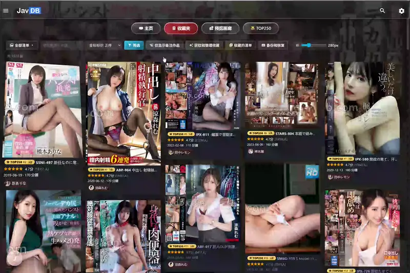
  </a>
  
▶️ <b><a href="screenshots/1.mp4">点击此处查看完整对比演示视频 (1分13秒)</a></b>

  
<em>⚠️ 视频内有暴露画面，请确认观看环境</em>

---

<table width="100%">
  <tr>
    <td width="50%" align="center" valign="top">
      
       
      <b>全局导航</b>
      
<i>重构顶部导航与功能药丸标签，</i>

    </td>
    <td width="50%" align="center" valign="top">
      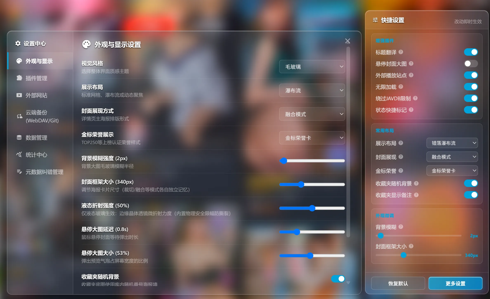
       
      <b>两级设置中心与功能控制台</b>
      
<i>外观、插件、播放源、WebDAV 云同步、数据管理一目了然</i>

    </td>
  </tr>
  <tr>
    <td width="50%" align="center" valign="top">
      <!-- 预留插槽 1：三大视觉质感主题（可替换为您的截图） -->
      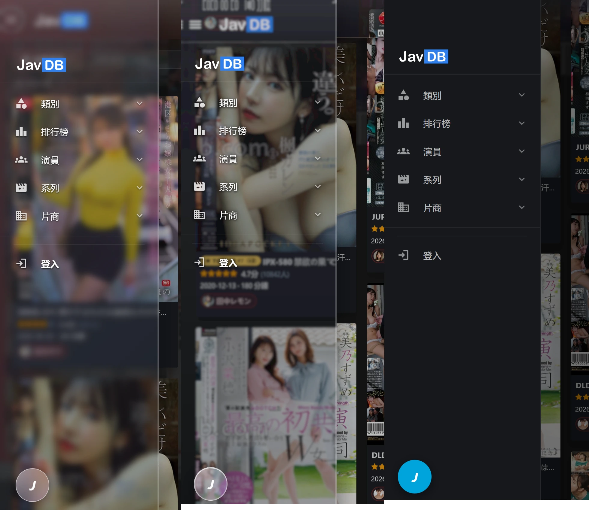
       
      <b>三大质感主题（Emby / 毛玻璃 / 液态玻璃）</b>
      
<i>内置真实物理透镜折射与高光掠影，追求最新的"玻璃拟态"效果</i>

    </td>
    <td width="50%" align="center" valign="top">
      <!-- 预留插槽 2：番号详情页与多源播放（可替换为您的截图） -->
      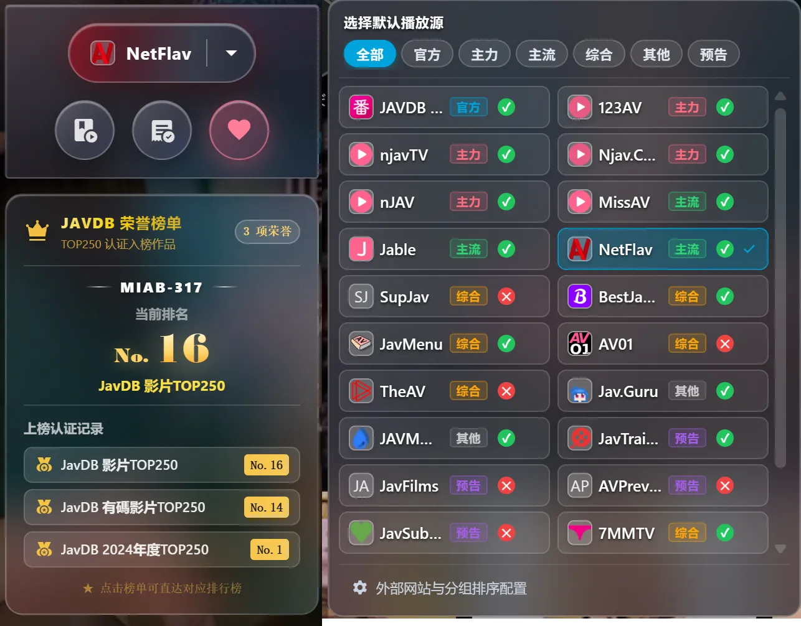
       
      <b>番号详情页金标荣誉与多源播放</b>
      
<i>自动嗅探外部播放源，提取站点主色调，更有 Steam 风格 3D 金标荣誉卡</i>

    </td>
  </tr>
  <tr>
    <td width="50%" align="center" valign="top">
      <!-- 预留插槽 3：独立高清预览画廊（可替换为您的截图） -->
      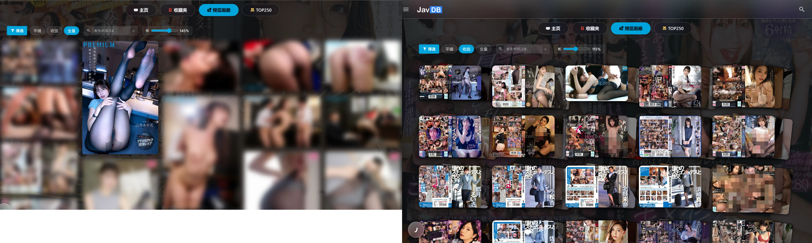
       
      <b>【预览画廊】存留自己最喜欢的剧照</b>
      
<i>多源嗅探官方高清大图，支持瀑布流排版与无损全屏灯箱漫游</i>

    </td>
    <td width="50%" align="center" valign="top">
      <!-- 预留插槽 4：私人媒体库与本地打分（可替换为您的截图） -->
      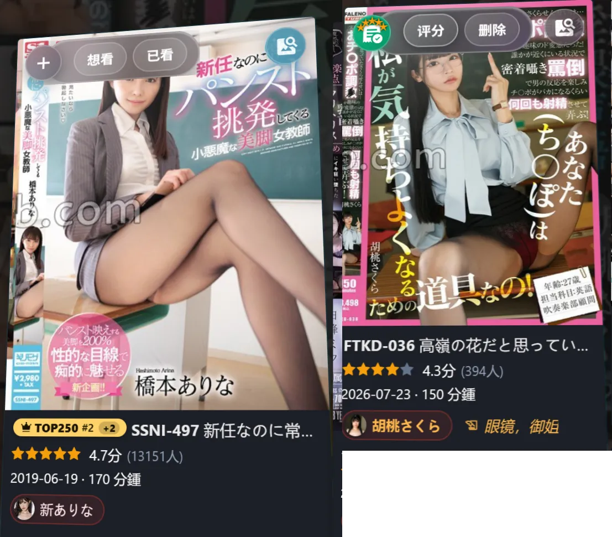
       
      <b>独立本地数据库与自由打分</b>
      
<i>想看/已看状态一键切换，个人 1~5 星打分与官方评分互不干扰，支持随手记笔记</i>

    </td>
  </tr>
  <tr>
    <td width="50%" align="center" valign="top">
      <!-- 预留插槽 5：数据统计大盘（可替换为您的截图） -->
      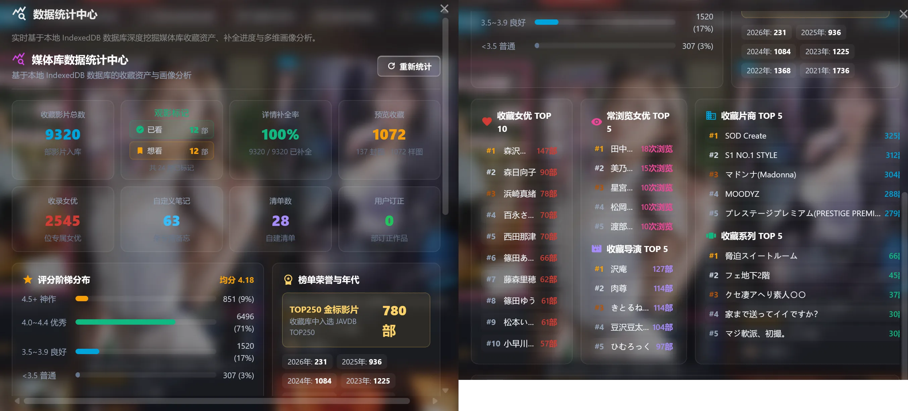
       
      <b>私人观影画像与全维数据大盘</b>
      
<i>总观影时长、喜爱女优排行榜、片商偏好、类型词云雷达图实时生成</i>

    </td>
    <td width="50%" align="center" valign="top">
      <!-- 预留插槽 6：元数据纠错与自愈（可替换为您的截图） -->
      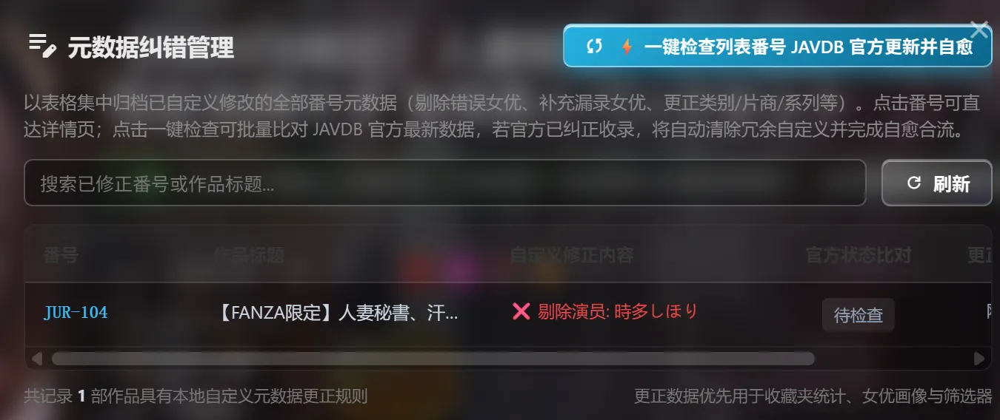
       
      <b>强迫症福音：元数据自愈纠错系统</b>
      
<i>自由更正错漏演员与分类，支持一键比对官方最新数据并自动智能自愈</i>

    </td>
  </tr>
</table>

---

## 超丰富功能全景介绍

### 1. 影院级视效重构（三种质感随心切换）

- **三大视觉流派**：
  - **EMBY 经典**：沉稳高级的深色流媒体质感，完美EMBY经典体验。
  - **毛玻璃 (Glass)**：细腻优雅的亚克力通透质感，搭配动态背景虚化，柔和有层次。
  - **液态玻璃 (Liquid Glass)**：追求最新的"玻璃拟态"效果，边缘有真实的折射扭曲和高光。
- **丰富的海报陈列方式**：
  - **右侧裁切模式**：自动聚焦AV影片封面包装右侧图区域，让海报最好看的一面面向用户。
  - **完整大封面模式 / 融合模式**：展现原汁原味的整张海报，封面与环境背景柔和过渡，且可以互动卡片小图封面。
  - **Pinterest 式瀑布流**：打破死板方块，自适应高低海报，横向自然排列，排版具有冲击力。
  - **Steam 风格 3D 物理倾斜卡牌**：悬停在海报上时，卡片跟随鼠标发生立体倾斜高光流转，。
  - **悬停超清预览气泡**：鼠标停在封面上，无需点击进入页面，自动浮现超清大图气泡，还可自由调节弹出延迟与大小。

---

### 2. 超越官方限制的“本地私人媒体库”

- **自建独立本地数据库**：
  - 不依赖官方服务器，所有收藏记录、状态与备注安全保存在您的浏览器本地，断网也能飞速检索。
- **状态快捷标记与“个人评分”分离**：
  - 海报角落一键点亮【想看 / 已看】，还能直接打上 1~5 星。
  - **核心特色**：**您的个人打分与官方大众均分彻底分开！** 官方评 3 星但您很喜欢？直接点亮您的 5 星，不受大众均分影响。
- **个性化备注**：
  - JAVDB官方对影片做备注需要用看过功能，限制多，且只支持影片，本脚本的备注对于所有元素据都支持。
  - 可选择直接在封面底部展示醒目的**斜体橙色笔记便签**，找片一目了然。
- **多维智能筛选与排序**：
  - 可以在收藏夹中按女优、按片商、按导演、按分类标签极速筛选，也可按添加时间、上映日期、等随意排序。

---

### 3. 多源播放跳转与全网情报秒查

- **告别失效与卡顿，全网多源一键看**：
  - 如果您是官方会员，可直接在页面内免跳转播放官方片源。
  - 如果不是会员或需要更多线路，脚本自动在详情页提供**各大主流在线播放站点（如 MissAV 等）的快捷跳转按钮**。
  - 自动提取站点 LOGO 主色调，按钮精致美观。
  - **完全开放自由**：可以在设置里任意拖拽调整播放站点顺序，修改网址规则，甚至添加您自己的私藏播放站点。
- **各大番号数据库一键核对**：
  - 详情页番号后方自动陈列各大权威情报站（JAVBUS、JAVLibrary、FANZA、JAVtxt 等）小图标，点击即可直达对比磁链、查看更多网友评论。

---

### 4. 【预览画廊】存留自己最喜欢的剧照

- **告别一张小图猜整部片**：
  - 顶栏直接集成独立的**【预览画廊】**专区！
  - 脚本自动接入外部高清剧照源（javfree、javstore、blogjav 等），自动抓取作品全套官方超清剧照。
- **沉浸式画册体验**：
  - 支持高清大图瀑布流陈列；
  - 点击任意图片即刻唤醒**无损全屏灯箱**，支持鼠标滚轮缩放、键盘上下左右键切换图片，看剧照就如同翻阅精美纸质写真集。

---

### 5. 女优全方位情报档案

- **Gfriends 高清写真头像库替换**：
  - JAVDB官方自带头像通常质量不高，脚本自动对接 Gfriends 高清头像库（男女演员均支持）
  - 如果云端图库没有匹配到，会自动平滑保留官方头像。
- **女优个人信息与现役状态**：
  - 鼠标悬停在女优名字上，即刻获知女优的**年龄、出生日期、身高、三围**等官方信息。
  - 贴心标注**“现役 / 已退役”**，让您一眼了解演员最新动态。且可同时自定义这个演员备注。
- **一键红心收藏女优**：
  - 头像右上角附带心形标记为已经收藏的女优，信息卡片中可以把她加入收藏清单。

---

### 6. 强迫症专属：元数据纠错与“一键自愈”系统

- **随心修补官方错漏**：
  - 官方把共演女优漏掉了？片商或系列归类搞错了？分类标签不够准确？
  - 在详情页直接点击编辑，**自由添加遗漏女优、划掉错误女优、更正片商与系列**。
- **纠错管理后台**：
  - 设置中心专门开辟了“元数据纠错管理”表格，集中记录你所有修改过的作品，支持一键搜索。
- **一键比对云端自愈**：
  - 当日后官方数据库更新补全了该女优或更正了信息，只需在后台点击【一键检查自愈】，脚本会自动比对最新官方数据。若官方已正确收录（以用户写入的为准），将**自动清退本地冗余规则并完成合流**，永远保持数据库干净纯正！

---

### 7. 私人观影画像与数据统计大盘

- **对自己收藏的数据有更充分了解**
  - 进入设置中心的【数据统计中心】，脚本会基于你的本地媒体库，为您绘制出详尽的可视化画像：
  - **资产概览**：累计收藏总数、已看与想看比例。
  - **女优喜好榜**：自动统计出你收藏最多、打分最高的的女优 TOP 10。
  - **厂牌偏好**：一眼看出你最钟爱哪家片商或导演。
  - **口味雷达**：类型标签词云与排名，清晰了解自己的独家观影口味。

---

### 8. 安全无忧：WebDAV / Git 云端与本地双重备份

- **数据完全属于你自己**：
  - **WebDAV/私有 NAS / Nextcloud / Alist**：全面兼容各种Webdav协议和私有云存储。
  - **GitHub / Gitee 云备份**：支持通过 Personal Access Token 将媒体库一键保存在你的个人私有仓库中。
  - **本地文件导出**：随时导出完整的 `.json` 备份文件存进硬盘。
- **隐私保护与凭据脱敏**：
  - 备份与导出时提供【包含登录凭证与密钥】开关。如果要将备份文件分享给朋友，**只需关闭该开关，导出的文件将自动剔除您的账号密码与密钥**，安全无忧！
- **智能增量合并与防误删保护**：
  - 导入备份时支持“合并导入”与“覆盖导入”，绝对不会意外冲掉您本地辛苦记录的心得笔记。

---

### 9. 顺滑无比的日常浏览优化

- **无限平滑向下滚动**：浏览列表时无需手动点击“下一页”，滑到页面底部自动无缝加载新内容。
- **解锁官方限制**：免 VIP、免繁琐登录，完整展开所有精彩长评论与相关清单列表。
- **还原日文原标题**：自动拦截怪异的机器翻译，优先呈现原汁原味的日文原标题，并提供地道的一键翻译功能。
- **纯净无干扰**：自动跳过年龄确认提示框；强力屏蔽顶部大横幅推广、最新网址公告与磁链广告区，还原清爽页面。

---

### 开始使用

装好之后直接访问 JAVDB，页面不会自动变成新界面。第一次启动默认关闭的，需要在屏幕点击左下角的**粉色J圆形按钮**开启：

- **左键点击** —— 开启 / 关闭整个皮肤。关掉之后网站立刻恢复原样，随时可以再开。
- **右键点击** —— 在三种视觉风格之间循环切换。
- 鼠标悬停在按钮上，会显示当前风格和版本号。

### 三个入口

| 入口 | 位置 | 作用 |
| --- | --- | --- |
| **快捷设置** | 鼠标悬停顶栏右侧的齿轮 | 弹出小面板，常用开关一屏搞定，改动立即生效 |
| **完整设置** | 点击顶栏右侧的齿轮 | 打开大设置窗口，分七个板块 |
| **视图切换** | 鼠标移到左上角 LOGO 上 | 横向滑出"主页 / 收藏夹 / 预览画廊 / TOP250"四个按钮，用以在不同界面快捷切换。 |

---

## 功能详解

### 一、三种视觉风格

#### 顶部栏与左侧菜单

原来的 JAVDB 导航栏被换成了一条**通透的顶部栏**：左边是菜单按钮和 LOGO，右边是搜索和设置。顶部栏用的是"上深下透明"的渐变，页面内容可以从下面滚过去，不会像原来那样被一条实心色块挡住。

点击左上角菜单按钮，会从左侧滑出一个**抽屉式菜单**，里面放着：

- 类别、排行榜、演员、片商四个常用入口；
- 你原来账号里的全部菜单项（个人资料、我的清单、收藏的演员、通知中心、登出……），每一项都配了对应的图标。

#### 卡片动效

鼠标滑过任意一张作品海报时，卡片会**跟着鼠标轻微倾斜**，同时有一道光从卡片表面扫过——像在拿着一张有厚度的实体卡牌。这是全站统一的交互，在首页、收藏夹、榜单里都一样。

#### 界面净化

脚本会自动隐藏这些干扰内容（**只在皮肤开启时生效，关掉皮肤就恢复原样**）：

- 主页顶部的"最新网址"公告条；
- 页面里各类广告位和推广卡片；
- 原版页面底部的"关于 / 条款 / 隐私 / 广告投放"区块；
- 悬浮在右下角的下载按钮和右上角的跳转按钮；
- 原版那个占地方的老式搜索栏。

---

### 二、全新首页与卡片

#### 三种排列方式

首页的作品列表可以在三种布局间切换：

| 布局 | 效果 |
| --- | --- |
| **经典网格** | 整整齐齐的方阵，和官方一样一眼看最多的作品，信息量大。且可自定义封面大小和列数 |
| **错落瀑布流** | 每张海报高度略有不同，像Pinterest/小红书那样错落排列，封面能看到更多，布局比较时尚潮流 |
| **动态聚焦** | 完全隐蔽所有影片文字信息，纯整齐并列的封面海报强，鼠标停在哪张，哪张就放大突出，其余自动让开，滑出又合并。布局前卫视觉冲击强 |

<table>
<tr>
<td width="33%" align="center">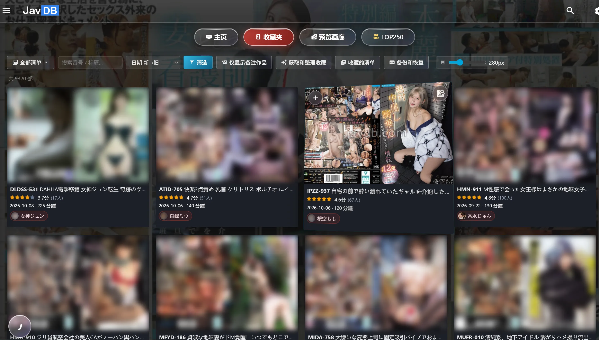 <b>经典网格</b></td>
<td width="33%" align="center"> <b>错落瀑布流</b></td>
<td width="34%" align="center"> <b>动态聚焦</b></td>
</tr>
</table>

#### 卡片上的信息

每张卡片都是"一图看懂"：

- **海报封面** + 作品标题 + 星级评分 + 日期 + 类别标签；
- **演员头像徽章** —— 小圆头像加名字。你收藏过的女优会用红底标出来，做过的备注会用橙色标出名字；
- **共演演员堆叠** —— 如果一部作品演员很多，会折叠成一摞小头像加一个数字，点一下展开全部；
- **金标奖章** —— 上过 TOP250 等榜单的作品，封面角上会挂一枚金色奖章，写明榜单名和排名；
- **状态提示** —— 下架作品有红色角标，信息不全的显示灰点。

#### 看过的作品会变色

浏览时，**没看过的作品标题是淡紫色的**，进过详情页之后（浏览器记住的已访问状态）会恢复成正常的白色。这样扫一眼列表就知道哪些是新面孔。

---

### 三、详情页大改造

作品详情页是改动最大的地方。

#### 大图背景

整张海报被放大铺满屏幕，做重度模糊处理，整页透出海报的颜色氛围——这是 Emby 电影详情页最标志性的感觉。**模糊程度可以在设置里用滑杆调**。

#### 海报排版四种模式

详情页的海报怎么摆，你有四种选择：

| 模式 | 效果 |
| --- | --- |
| **右侧裁切** | 海报裁掉左半，只留人物所在的右半部分，紧凑利落 |
| **完整全封面** | 整张海报完整居中展示，往下滚动时自动变成顶部一条小信息条 |
| **融合模式** | 静止时是大图，一旦往下滚，标题到顶的瞬间无缝切换成两栏紧凑排版（默认模式） |
| **混合模式** | 参考知名影评网站 Letterboxd 的三栏排版：海报、信息、操作面板各占一栏 |

每种模式的封面大小都**单独记忆**，你在"完整全封面"下调过的尺寸，切到"融合模式"不会被打乱。

<table>
<tr>
<td width="50%" align="center">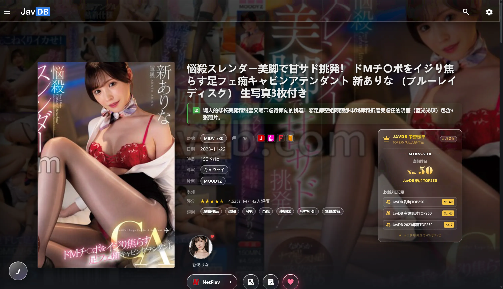 <b>右侧裁切</b></td>
<td width="50%" align="center"> <b>完整全封面</b></td>
</tr>
<tr>
<td width="50%" align="center"> <b>融合模式（默认）</b></td>
<td width="50%" align="center"> <b>混合模式（Letterboxd 三栏）</b></td>
</tr>
</table>

#### 详情页上的操作

- **播放按钮** —— 一个分体式按钮：主体部分点击就用当前选中的片源开始播放；右侧的小箭头展开完整片源列表，随时换源。按钮的发光颜色会**自动跟着当前片源的品牌色变化**。
- **三个圆形按钮** —— **想看**（蓝）、**看過**（绿）、**存入清單**（粉）。点击后按钮会亮起并带涟漪动画，以后再看这部作品一眼就能认出状态。
- **番号旁的复制按钮** 和 **備註按钮** —— 一键复制番号、写笔记（有备注时按钮变橙色提醒你）。
- **信息站点 LOGO 排** —— 番号后面一排小图标，点一下就能跳到 JAVBUS、JAVLib、FANZA動画、JAVtxt 等资料站查这部作品。
- **女优资料卡** —— 鼠标放在女优头像上，会浮出一张精致的卡片（详见[第九节](#九女优资料卡)）。
- **金标荣誉展示** —— 上过榜单的作品会在详情页展示荣誉信息，有"金标荣誉卡 / 简约金标条 / HUD 徽章 / 关闭"四种展示风格可选。
  
- **元数据纠错** —— 导演、片商、系列、类别、演员这些字段旁边都有一个 **✎ 编辑** 小按钮，官方信息有误或缺失时，你可以自己修正（详见[第十一节](#十一数据安全与备份)）。

#### 原有功能全部保留

磁力链接、用户短评、相关清单这些 JAVDB 的原生功能一个都没少，只是重新排版成了统一的深色卡片样式，短评文字也调成了适合暗背景的柔和白色。

---

### 四、我自己的收藏夹

**这是整个脚本最核心的功能。**

JAVDB 官方的"我的清单"只能看，不能搜、不能筛、不能排序、不能写笔记，作品多了之后基本没法用。脚本把整个清单**搬进你的浏览器本地**，建成一个真正的个人影库。

#### 怎么建起来

进收藏夹页面，点工具条上的 **"获取和整理收藏"**，里面有六个动作：

| 动作 | 说明 |
| --- | --- |
| **同步清单** | 先勾选要同步的清单，再拉取里面的作品。新增的清单可以只同步新增部分，不用全量重跑 |
| **同步想看 / 看過** | 从 JAVDB 的想看、看過专属页面快速同步标记状态，通常几分钟内完成 |
| **补全信息** | 只为库里还没补全的作品抓取详情（增量、不重复） |
| **刷新详情** | 强制重抓库内全部作品，跟进演员改名、信息更正等（耗时较长，可随时暂停） |
| **识别性别** | 逐个访问演员主页，标记出男优（识别一次永久生效） |
| **同步已收藏演员** | 同步你在 JAVDB 关注的女优，点亮头像上的小红心徽章 |

每一步都能**随时暂停、继续或取消**，进度条上实时显示"已完成 / 总数"和当前步骤。抓取速度可以自己调（并发 1 到 6，默认 3），怕被网站限制就调低一点。

脚本本身也很克制：一旦察觉网站开始限制访问（包括触发人机验证），会**自动停下来保护你的账号和 IP**并提示你稍后再试，而不是硬碰硬。

#### 平时几乎不用手动同步

脚本会**看着你在 JAVDB 上的操作**：当你在网站上把一部作品加入清单、移出清单，或者标记想看、看過时，脚本会**立刻把变化写进本地收藏夹**——不需要你再去点一次"同步"。

清单改了名字或数量这类小变化也会自动跟上，不会打断你正在做的事。就算你是在手机上完成的收藏，下次打开网页同步时或者手动进入某一影片，均会检测对比然后同步把它补进来。

#### 收藏夹里能做什么

| 功能 | 说明 |
| --- | --- |
| **搜索** | 按番号或标题实时搜索，**连你写的备注内容也能搜到** |
| **筛选** | 七个维度：演员、片商、系列、导演、类别、年份、金标。勾选即过滤 |
| **共演筛选** | 同时选中两位以上演员，只看他们**共同出演**的作品，候选会自动收敛 |
| **快捷开关** | 只想看、看过、只看金标、只看有备注、只看未补全、最近 7 / 30 / 90 天发行 |
| **排序** | 日期、评分、评价人数、番号、入库时间、浏览量、金标等级（金标按 TOP250 等级自动加权） |
| **清单范围** | 多个清单可以勾选叠加过滤 |
| **条件胶囊** | 每个已生效的条件都显示成一枚胶囊，点上面的 ✕ 就能单独去掉 |
| **显示大小** | 一条滑杆实时调整封面大小（180–560 像素），网格和瀑布流都跟着变 |
| **卡片扩展信息** | 比首页卡片多显示演员和片长，还能直接在卡片上看到你写的备注 |
| **状态保持** | 从收藏夹点进详情页再返回，筛选条件、排序和滚动位置全都还在 |

作品多了也不会卡：列表用的是**无限滚动**（滚到底自动加载下一批），大库照样秒开。

第一次打开还是一片空白时，页面会直接告诉你下一步该做什么——不会让你对着空屏发呆。

#### 收藏夹界面

<table>
<tr>
<td width="50%" align="center">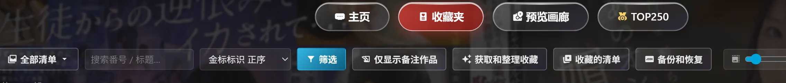 <b>收藏夹工具条</b> 清单范围 · 搜索 · 排序 · 筛选 · 显示大小</td>
<td width="50%" align="center">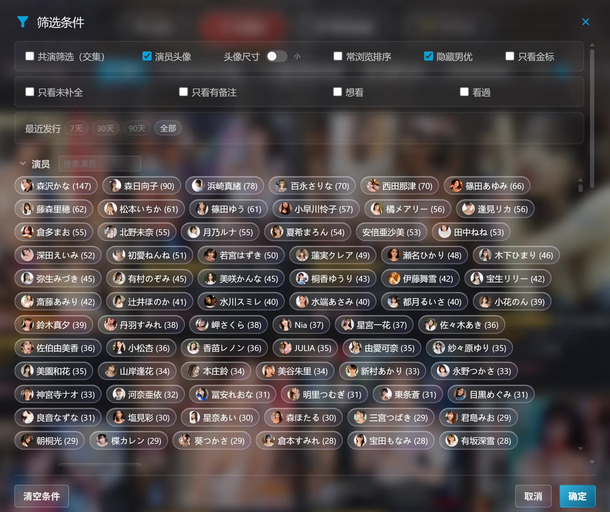 <b>高级筛选浮层</b> 所有元数据都可以筛选</td>
</tr>
</table>

#### 收藏的清单

工具条上还有 **"收藏的清单"** 按钮，可以浏览别人公开分享的清单，并且用本地收藏夹的视图重排——纯预览，不会污染你自己的库。

---

### 五、预览画廊

"预览画廊"是收藏夹的附属视图，专门用来**浏览作品的剧照和预览图**。

- 按作品分组，左边是封面，右边是这一部的所有预览图；
- 三种展示方式：**平铺**（一张挨一张）、**全量**（全部图片铺成瀑布流）、**收拢**（作品卡片堆叠，点开哪部就展开哪部的大图，其余的变暗让路）；
- 点开任意一张图片会进入**全屏灯箱**，可以左右翻页浏览，右上角一键关闭；
- 灯箱里可以**用滚轮缩放、拖动查看细节、双击放大**，也能直接按下 **"收藏此图"** 把好图留下来；
- 同样支持按番号和标题过滤，显示大小也能用滑杆统一调节。

> 💡 **怎么往画廊里存图？** 在任意作品详情页点开预览大图，点右上角的 **"收藏此图"**，这张图就会进入你的预览画廊。日积月累，画廊就成了你自己的剧照收藏库。

<table>
<tr>
<td width="50%" align="center"> <b>预览画廊</b> 平铺 / 全量 / 收拢三种视图</td>
<td width="50%" align="center">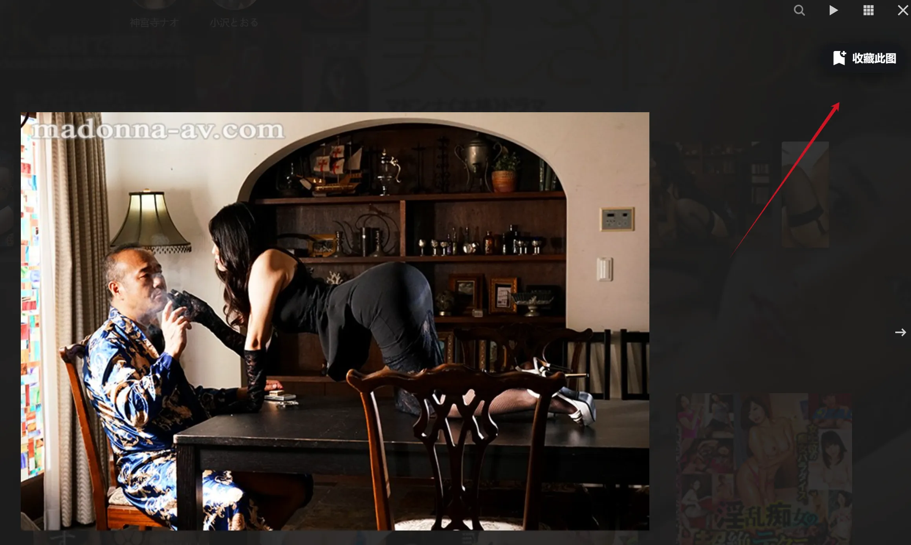 <b>全屏灯箱</b> 滚轮缩放 · 拖动 · 左右翻页</td>
</tr>
</table>

---

### 六、TOP250 与热播榜

#### 热播榜：打开就能看

热播榜**不需要登录**，打开即见，可以切日榜、周榜、月榜。每部作品显示排名、评分、日期，以及是否带中文字幕磁链。

#### TOP250：登录一次，永久使用

完整的 TOP250（250 部）需要一次身份验证。**用普通免费账号就行，不需要会员。**

- 登录窗口有两个选项：直接填 JAVDB 账号密码，或者粘贴一个现成的 Token；
- 凭证保存在你自己浏览器的本地，脚本不会发送到任何第三方；
- 验证一次之后，之后每次打开都是直接看。

#### 离线缓存

TOP250 支持 **"离线缓存全量 250 部"**：点一下把整份榜单存到本地，之后即使网络不好也能秒开浏览。缓存有失效时间，过期会自动更新。

#### 榜单里也能筛选

TOP250 面板里的 **"筛选"** 按钮，用的就是收藏夹那套高级筛选器：关键词、评分上限、荣誉、演员（含共演模式）、片商、系列、导演、类别、年份，一应俱全。名次前三的作品还有金银铜三色角标。

> 💡 如果你本来就登录着 JAVDB 会员账号，脚本会自动让路，不干扰你原本的会员权限。

<table>
<tr>
<td width="50%" align="center">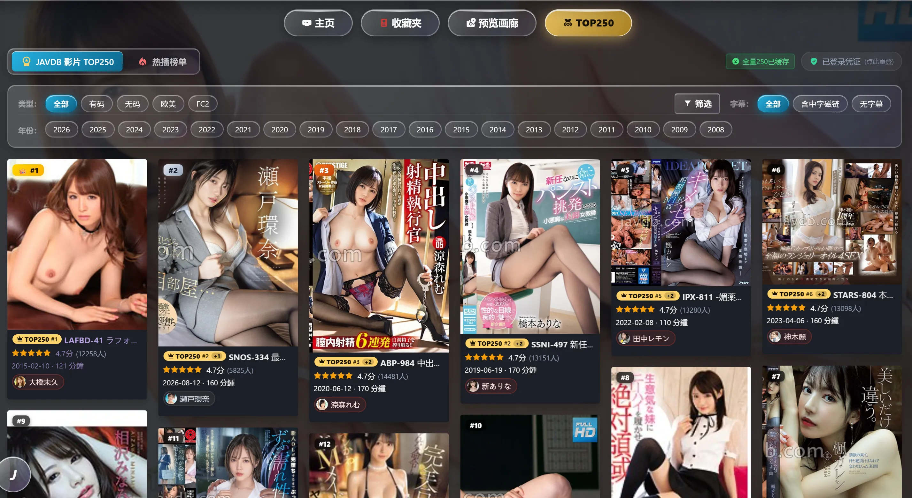 <b>TOP250 全量 250 部</b> 金银铜名次角标 · 可离线缓存</td>
<td width="50%" align="center">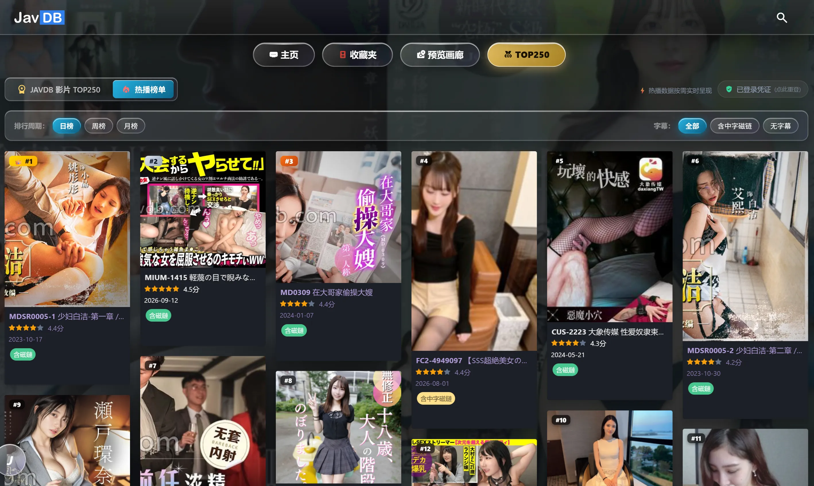 <b>热播榜</b> 日榜 / 周榜 / 月榜 · 免登录</td>
</tr>
</table>

---

### 七、外部播放与信息站点

#### 23 个播放源，一键直达

遇到一部作品想在别的地方看？详情页的播放按钮右侧有一个下拉菜单，列出**23 个外部站点**，按"主力 / 主流 / 综合 / 其他 / 预告"分好组，每个站点都显示自己的 LOGO 图标，点一下就带着番号跳到对应页面。

| 分组 | 包含站点 |
| --- | --- |
| **主力** | 123AV、njavTV、Njav.Com、nJAV |
| **主流** | MissAV、Jable、NetFlav |
| **综合** | SupJav、BestJavPorn、JavMenu、AV01、TheAV、7MMTV、AvMates、HOHOJ、XSZ-AV、JavHD |
| **其他** | Jav.Guru、JAVMOST |
| **预告** | JavTrailers、JavFilms、AVPreview、JavSubtitled |

**站点可用性检测**：脚本会先探一下这个站点上到底有没有这部作品，有的站点才亮起来，避免点进去发现是空页面。

<table>
<tr>
<td width="50%" align="center"> <b>片源选择菜单</b> 按分组排列 · 每个片源带在线状态 ✓ / ✕</td>
<td width="50%" align="center">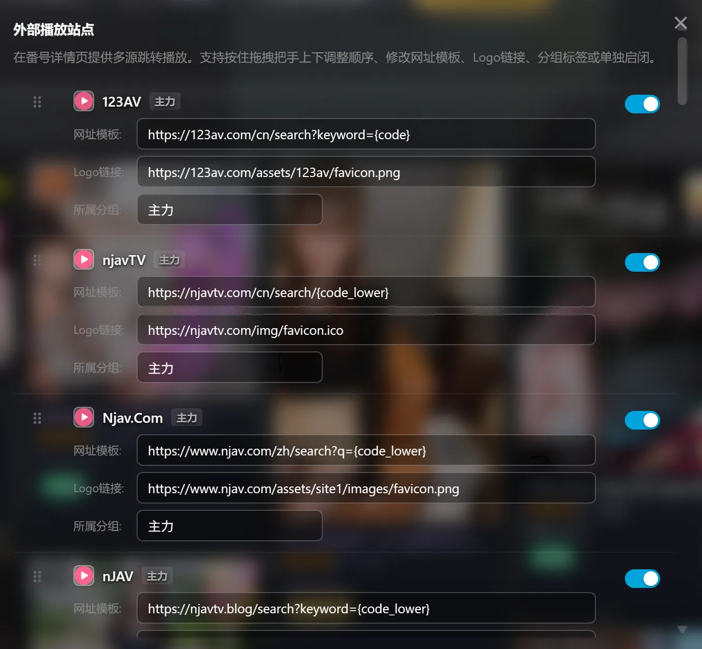 <b>外部网站设置</b> 拖拽排序 · 自定义站点 · 单独开关</td>
</tr>
</table>

#### 信息站点

番号后面还有一排资料站的小图标：**JAVBUS、JAVLib、FANZA動画、JAVtxt**，一键跳到对应网站查这部作品的详细资料。

#### 全部可以自己改

在 **设置 → 外部网站** 里，三个站点列表（播放站、信息站、预览图站）都能自由管理：

- **拖动排序** —— 按住拖拽把手上下调整，把你最常用的排到最前面；
- **改网址** —— 修改站点链接模板；
- **换图标** —— 换成你喜欢的 LOGO；
- **分组** —— 给站点归类；
- **单独开关** —— 用不上的关掉，不占位置；
- **添加自定义站点** —— 预设里没有的网站，自己填名称、链接模板、图标就能加进来。

图标加载不出来时，脚本会自动用备用图标，再不行就退化显示站点缩写，不会出现空白方块。

---

### 八、备注与标记系统

#### 到处都能写笔记

- **作品级备注** —— 详情页番号旁边的 **"備註"** 按钮，写下任何想记的东西（比如"强推""待看""周末看"）；
- **演员 / 片商 / 系列级备注** —— 在对应的详情页点 **"备注"** 按钮，给这个人或这家公司写笔记。

写完的备注会在收藏夹里直接显示在卡片上（橙色斜体），也能用来搜索和筛选——**"只看有备注"** 开关一点，所有写过笔记的作品就都列出来了。

#### 悬停卡片

鼠标停在女优头像上，会浮出一张**信息卡片**，里面有：

- 女优姓名和现役 / 引退状态；
- 生日、年龄、身高、罩杯、三围等资料；
- 你为她写的个人备注；
- **收藏按钮** —— 点一下，收藏会真实同步到你的 JAVDB 账号，页面上所有同一个女优的头像角标也会同步亮起小红心。

#### 封面上的状态按钮

开启"状态快捷标记"插件后，鼠标移到封面左上角会出现一个圆形按钮，可以快速标记：

- **想看**（蓝色）/ **看过**（绿色），还能打五星评分；
- 鼠标移上去会横向展开"想看 / 看过 / 修改 / 删除"一排按钮；
- 封面右上角还有一个**预览图按钮**，点开就是全屏预览大图浏览器——支持缩放、拖动、多片源切换、底部缩略图条。

---

### 九、女优资料卡

脚本内置了一个女优资料库，悬停任意女优头像就能看到：

- **现役 / 引退状态** —— 绿色是现役，灰色是已引退；
- **身高、罩杯、三围、生日、年龄**等基本资料；
- 资料查不到时会明确显示"暂无生平资料"，不会显示错误内容。

数据有本地缓存，看过的女优再次悬停是**瞬间出现**的，不会每次都去联网。

---

### 十、数据统计中心

**入口：设置 → 统计中心。**

脚本会自动分析你的收藏库，生成一份属于你自己的观影画像：

| 板块 | 内容 |
| --- | --- |
| **总览** | 收藏影片总数、详情补全率、预览收藏数、收录女优数、自定义笔记数、清单数、手动订正数 |
| **评分分布** | 4.5+ 神作 / 4.0~4.4 优秀 / 3.5~3.9 良好 / 3.5 以下普通，每一档的比例都用进度条画出来，并显示你的平均分 |
| **荣誉与年代** | TOP250 金标作品数量，以及收藏作品的年代分布 |
| **收藏女优 TOP 10** | 你收藏作品最多的女优 |
| **常浏览女优 TOP 5** | 你最常点开看的女优（进入详情页会自动计数） |
| **导演 / 片商 / 系列 TOP 5** | 你的口味偏好一目了然 |

统计时**自动排除男演员**（脚本会识别并记录性别），数字更贴近你真正关心的。

 

  
   
  <b>数据统计中心</b> · KPI 总览 · 评分阶梯分布 · 收藏与浏览排行

 

---

### 十一、数据安全与备份

辛辛苦苦整理的收藏夹当然不能丢。脚本提供了**四层保护**：

#### 1. 本地导出

**设置 → 数据管理 → 导出数据**，把全部影片、清单、备注、配置打包成一个 JSON 文件下载到电脑。

想恢复时点 **"导入数据"**，可以选择**合并导入**（保留现有数据，只补新的）或**覆盖导入**（完全替换）。

#### 2. 云端备份（WebDAV）

支持**坚果云、NAS、Nextcloud、Alist、InfiniCLOUD** 等所有标准 WebDAV 网盘。

设置里内置了图文指引，照着填就行。特别提醒：**坚果云的密码必须用"应用授权密码"，不能用登录密码**（设置面板里写了详细步骤）。

按钮：`测试 WebDAV 连接` / `立即备份到 WebDAV` / `查看 WebDAV 备份`。

#### 3. 云端备份（Git）

支持 **GitHub、Gitee、GitLab 以及自建 Git 服务**。适合已经习惯用 Git 管理数据的人，设置面板里也内置了 GitHub 令牌的逐步配置指引。

<table>
<tr>
<td width="50%" align="center">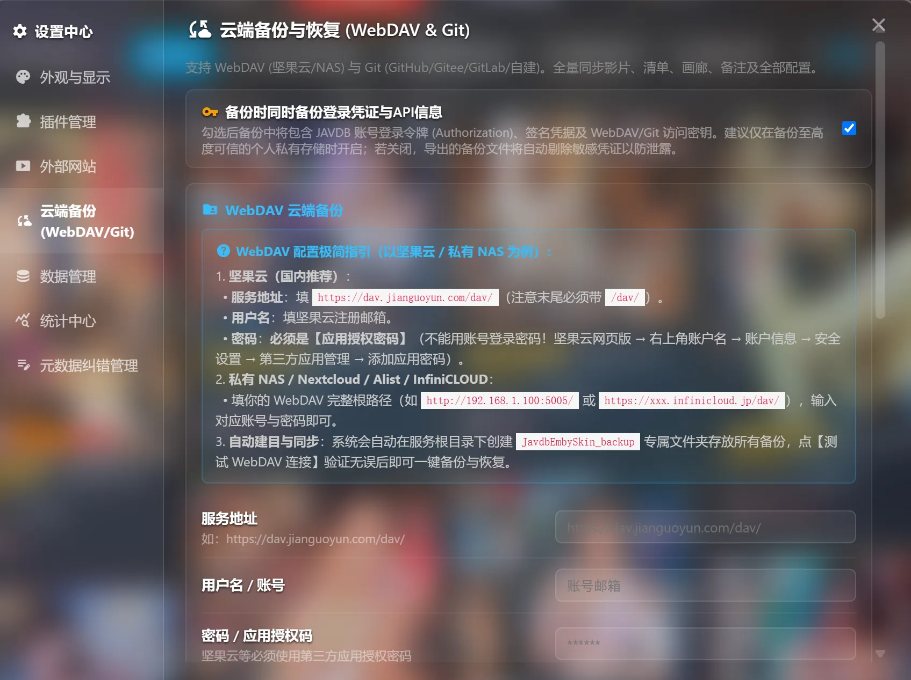 <b>云端备份设置</b> WebDAV 与 Git 双通道 · 内置配置指引</td>
<td width="50%" align="center">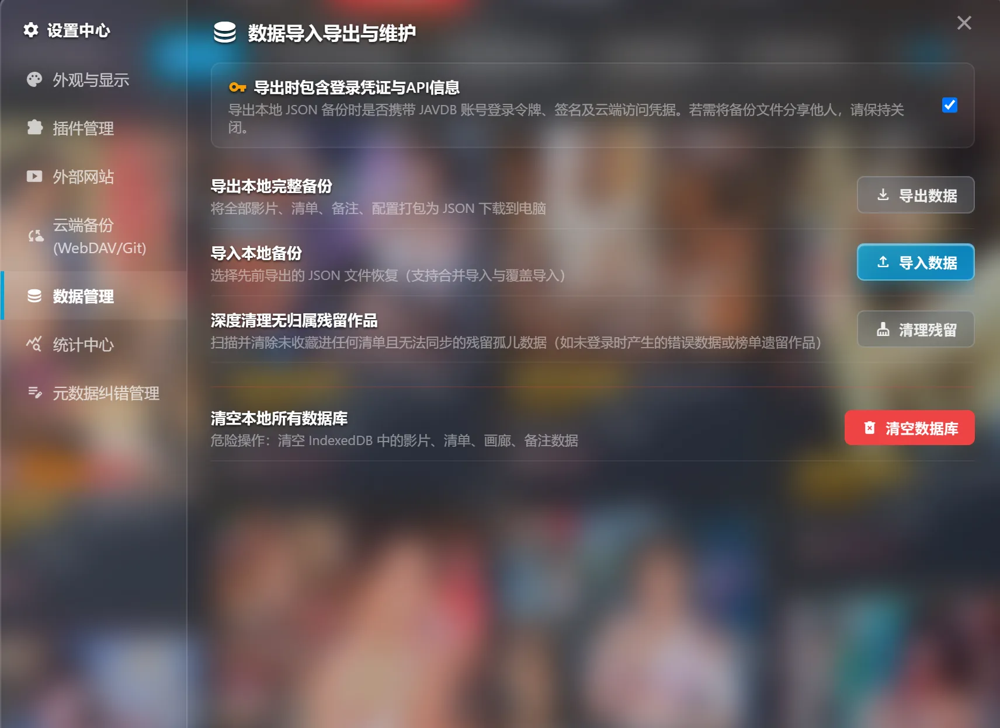 <b>数据管理</b> 导出 / 导入 / 清理残留 / 清空数据库</td>
</tr>
</table>

#### 4. 残留清理

- **"清理残留"** —— 扫描并清除不属于任何清单、也没有标记的孤立数据；
- **"清空数据库"** —— 彻底重置（有二次确认，且只会清空本地数据，不影响你的 JAVDB 账号）。

#### 还能自己修数据

用过一阵子你会发现，JAVDB 官方收录的信息偶尔会有错：演员漏了一个、类别写错了、片商标错了。脚本允许你**直接改**：

- 在详情页，**导演、片商、系列**字段旁边有 **✎ 编辑** 按钮，点开就能改（留空即恢复官方原值）；
- **类别**可以逐条排除、恢复，也能自己新增；
- **演员**可以排除错误的、补充漏掉的，还能**实时检索 JAVDB 官方演员库**——输入名字就会自动匹配，库里没有的也能作为自定义演员加进去。

<table>
<tr>
<td width="50%" align="center">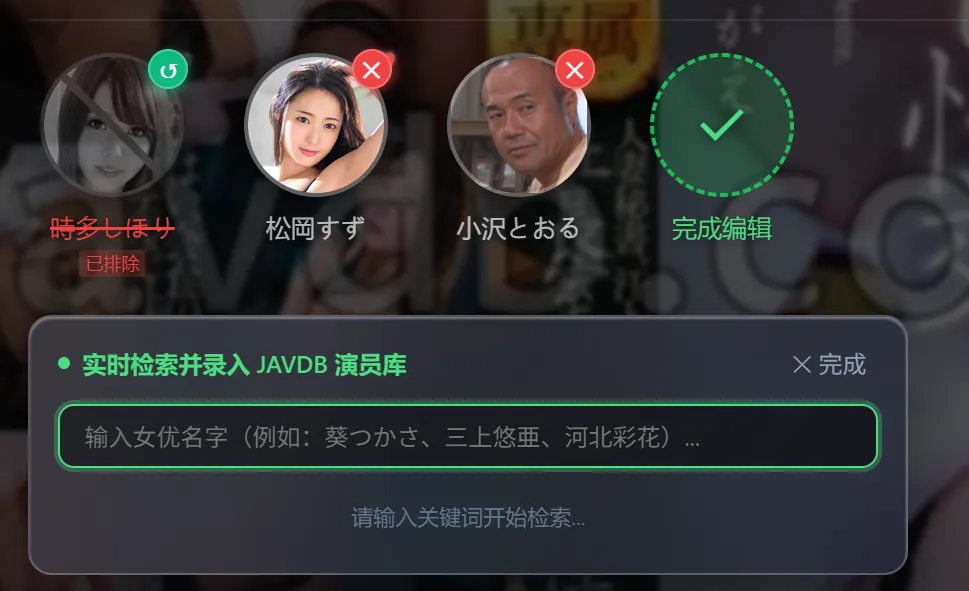 <b>本地订正女优数据</b> 本地订正女优数据</td></table>

你改过的地方都会有明确标记（"自定义""新增""已排除"），一眼就能分清哪些是官方数据、哪些是你自己的修正。

**设置 → 元数据纠错管理** 会列出一张表格，汇总所有你修正过的作品。表格支持搜索，每条都能单独撤销恢复官方数据。

更贴心的是顶部的 **"⚡ 一键检查列表番号 JAVDB 官方更新并自愈"** 按钮——它会批量比对官方的最新数据，如果官方已经自己改对了，就自动清除你之前的冗余修正，让数据保持干净。

---

### 十二、九个可开关的增强插件

脚本把增强功能做成了**插件开关**（**设置 → 插件管理**），用不上的可以关掉，界面更清爽：

| 插件 | 作用 | 默认 |
| --- | --- | --- |
| **还原日文原标题** | 屏蔽 JAVDB 自带的中文翻译，详情页始终显示纯正的日文原标题 | ✅ 开 |
| **标题翻译** | 自动把日文标题翻译成中文显示在详情页 | ✅ 开 |
| **悬停封面大图** | 鼠标悬停在封面上弹出超清大图和详细参数 | ✅ 开 |
| **外部播放站点** | 详情页提供 23 个外部站点的多源跳转播放 | ✅ 开 |
| **番号信息站点** | 番号后面显示 JAVBUS 等资料站的 LOGO 快捷入口 | ✅ 开 |
| **无限加载** | 列表滚到底自动加载下一页，不用再点"下一页" | ✅ 开 |
| **绕过 JAVDB 限制** | 免会员查看完整评论、相关清单，解锁 TOP250 与热播榜 | ⬜ 关 |
| **女优信息与收藏标记** | 显示女优资料、现役状态，以及头像上的红心收藏标记 | ✅ 开 |
| **状态快捷标记和预览图** | 封面上的想看 / 看过快捷按钮，以及预览大图浏览器 | ⬜ 关 |

最后两个默认关闭，**建议手动开启**——它们是使用体验提升最明显的两个。

---

### 十三、快捷键与隐藏操作

脚本没有铺一堆快捷键，只在真正用得上、且不会打扰你的地方放了几组：

| 按键 | 什么时候有用 |
| --- | --- |
| `Esc` | 关闭站内搜索弹窗、设置窗口、预览大图浮层 |
| `Enter` | 在搜索框里直接提交搜索 |
| `←` / `→` | 在预览画廊灯箱里翻上一张 / 下一张 |
| `+` / `-` / `0` | 在预览大图浮层里放大 / 缩小 / 恢复原始比例 |
| 鼠标滚轮 | 在预览大图里以鼠标位置为中心缩放 |
| 双击图片 | 在 1 倍与 2.2 倍之间快速切换 |

还有两个不太显眼但很实用的操作：

- **左下角圆形按钮右键** —— 直接切换视觉风格，不用进设置；
- **详情页番号旁的复制按钮** —— 一键复制番号，复制成功会显示"已複製 ✓"。

---

## 常见问题解答 (FAQ)

<b>Q1：开启这个脚本后，会导致电脑或网页变卡吗？</b>

 
<b>完全不会。</b> 脚本经过极为严格的性能优化，所有数据库读取、图片抓取与模糊渲染都采用了轻量化异步处理机制，不占用主线程运算。即使您的媒体库收藏了数千部作品，依然能够秒开、秒翻页、丝滑流畅。

<b>Q2：如果我想暂时换回官方原本的网页排版，该怎么操作？</b>

 
非常简单！脚本支持<b>双模式无缝共存</b>。点击右上角的齿轮图标打开设置中心，直接将最上方的【启用皮肤】开关关闭，整个网页会立刻毫秒级还原为官方原版样式；随时再次打开开关，又会立刻回到漂亮的影院模式。

<b>Q3：我换了一台新电脑，或者重装了浏览器，收藏的数据怎么带走？</b>

 
您有两种极为简便的同步方式：
1. <b>使用云端备份（推荐）</b>：在旧电脑的设置中心里配置好坚果云（WebDAV）或 GitHub，点击【立即备份】；在新电脑上输入账号点击【恢复】即可秒级同步。
2. <b>使用文件导出</b>：在旧电脑的【数据管理】中点击【导出数据】，将下载得到的 JSON 文件发送到新电脑，点击【导入数据】即可一键恢复。

<b>Q4：为什么有的番号没有外部播放按钮或者点开无法播放？</b>

 
外部播放按钮是根据各大公开资源站的规则自动匹配生成的。对于极其冷门、年代久远或尚未公开发行的极少数作品，外部站点可能暂未收录。您可以随时在设置中心的【外部网站】中自行添加更多第三方播放源，或者点击番号后面的 JAVBUS/JAVLib 图标去查询最新磁力链接。

<b>Q5：把备份文件发给朋友分享，会泄露我的账号密码吗？</b>

 
<b>绝对不会，只要您关闭了凭证导出开关。</b> 脚本在【数据管理】和【云端备份】中均内置了<b>“备份时包含登录凭证与密钥”</b>的安全开关（默认处于关闭状态）。关闭状态下导出的备份文件会自动剔除所有登录令牌、个人密钥与敏感信息，您可以放心地将珍藏清单分享给同好。

---

## 功能设置项一览

在右上角设置中心中，您可以自由调节以下全部细节：

| 设置面板 | 可调控选项 |
| :--- | :--- |
| **外观与显示** | 视觉风格（Emby经典 / 毛玻璃 / 液态玻璃）、展示布局（标准网格 / 瀑布流 / 动态聚焦）、封面裁切与融合模式、金标荣誉卡样式、背景模糊强度调节（0~80px）、封面卡片大小自由缩放（240~560px）、液态折射微调、悬停大图弹出延迟与尺寸 |
| **插件管理（可根据需求决定开关）** | 日文原标题还原、谷歌标题翻译、悬停封面大图浮层、外部多源播放、番号数据库直达、无限翻页加载、绕过VIP评论限制、女优情报与红心收藏、Gfriends高清头像替换、快捷标记与预览大图嗅探 |
| **外部网站** | 拖拽调整播放站点优先级、自定义添加新播放站点、番号情报站启闭与排序、剧照嗅探源优先级设置 |
| **云端备份** | WebDAV 坚果云/NAS 快速配置与一键测试、GitHub/Gitee 私有仓库同步、敏感凭据脱敏导出开关 |
| **数据管理** | 完整数据 JSON 导入与导出、无归属孤儿数据一键深度清理、本地数据库维护 |
| **统计中心** | 实时生成全维媒体库资产报表、已看时长折算、女优喜爱排行榜、厂牌排行、类型词云 |
| **元数据纠错** | 本地更正规则总览列表、按番号/标题搜索更正记录、一键比对 JAVDB 官方更新并自动智能自愈 |

---

## 脚本移植与致谢

移植以下脚本部分功能形成插件，感谢原作者的开源：

| 脚本名称 | 移植功能说明 |
| :--- | :--- |
| **[JHS-Pro](https://greasyfork.org/zh-CN/scripts/590210)** | 翻译功能、女优信息、设置界面、插件开关、WebDAV 备份、跳转外部观看 |
| **[JavDB 增强：评论 & 清单无限加载](https://greasyfork.org/scripts/590818)** | JAVDB评论和清单绕过会员限制 |
| **[JavDB Power Tools](https://greasyfork.org/scripts/586120)** | 热播/Top250榜单、GITHUB备份 |
| **[Javdb 增强脚本](https://greasyfork.org/zh-CN/scripts/539525)** | 想看，看过标记状态和预览图获取 |
| **[gfriends媒体服务器演员头像仓库](https://github.com/gfriends/gfriends)** | 用以替换JAVDB官方头像 |
| **[液态玻璃](https://github.com/childrentime/liquid-glass)** | 核心实现 |
| **[液态玻璃](https://kube.io/blog/liquid-glass-css-svg/)** | 原理参考 |

没有以下AI的帮助这个脚本永远不会出现，感谢技术平权：

| AI | 运作范围 |
| :--- | :--- |
| **Tencent HY3** | 基础架构搭建初版完善 |
| **Google Gemini3.8Flash** | 前端优化、核心开发 |
| **DeepSeek v4.1Flash** | 客观审计 |

---

## 常见问题

### 装完之后页面没变化？

1. 确认油猴扩展已经启用，脚本在管理面板里是"已启用"状态；
2. 确认你访问的确实是 JAVDB 网站（脚本只在 JAVDB 及官方镜像域名上生效，这是有意的保护措施，避免在别的网站误触发）；
3. 刷新一下页面（按 `Ctrl + Shift + R` 强制刷新）。

### 怎么关掉它？

点击左下角的粉色J字母圆形按钮，或者右键点它切风格。**关掉之后网站立刻恢复成你熟悉的原样，不会残留任何痕迹。**

### 会不会影响我原本的 JAVDB 账号和收藏？

不会。脚本只是读取网页上公开显示的信息，**不会修改你在 JAVDB 服务器上的任何数据**。会主动提交的操作是想看、看过、收藏女优——而且那本来就是你点按钮主动要求的。

会员账号更不用担心：脚本检测到你是会员时会自动让路，不干扰你原本的完整权限。

### 会不会被网站封号？

脚本刻意做了保护：

- 所有批量抓取都有**速度限制**和**随机间隔**；
- 一旦网站开始返回限制信号，**立刻自动停止**并提示你——宁可慢一点，不冒险；
- 抓取并发数可以自己调低。

正常使用完全不需要担心。

### 收藏夹同步很慢怎么办？

第一次同步确实需要时间（作品越多越久）。但：

- 之后都是**可以手动的增量更新**，只同步有变化的部分，几秒钟完成；
- 可以随时暂停、继续；
- 想要更快就把"并发"滑块调大（最高 6），网络好时可以明显提速。

### 换电脑了，数据怎么办？

用 **云端备份**（WebDAV 或 Git）或**导出 JSON 文件**，在新电脑上导入即可，影片、清单、备注、配置全都在。

### 数据存在哪里？会上传到别处吗？

**全部存在你自己浏览器本地。** 除了你主动开启的云端备份，脚本不会把任何数据发到第三方服务器。详见下面的[数据与隐私](#数据与隐私)章节。

### 支持手机吗？

脚本**主要为电脑浏览器设计**。只优先保证大屏幕上的体验，目前只在少数地方做了窄屏适配（顶栏按钮会缩小、动态聚焦模式的缩放比例会调整），手机上的完整体验尚未专门打磨。

如果你主要用手机，建议暂时先在电脑上使用；手机上的油猴环境（如 Kiwi Browser、Via 等）能否正常运行，取决于该浏览器对脚本接口的支持程度，没有保证。

---

## 隐私与免责声明

这一节请认真看，因为关系到你的数据。

- **默认全部本地。** 影片信息、清单、备注、统计资料都存在你浏览器自身的存储里（浏览器数据库），**不上传任何服务器**。
- **云端备份是可选的。** 只有你自己主动填写账号配置并点击备份时，数据才会发到你指定的网盘或代码仓库。备份地址和密码由你掌控。
- **登录凭证只存在本地。** TOP250 用到的账号凭证保存在你浏览器的本地存储中，不会发送给脚本作者或任何第三方。
- **第三方接口仅用于抓取公开数据。** 为了获取评论、榜单、翻译等信息，脚本会请求公开的数据接口。这些请求只携带作品编号等公开信息。
- **⚠️ 导出的备份文件请勿公开分享。** 备份包里除了你的收藏数据，还带有脚本配置和登录凭证——发到群里或贴到网上等于把账号交出去。自己保存好就行。
- **你自己主动做的操作会同步到 JAVDB。** 比如在卡片上点"想看 / 看過"、点"存入清單"、在女优资料卡上点"收藏"——这些都是你自己点的，效果和你直接在网站上操作完全一样。
- **随时可以完全清空。** 设置 → 数据管理里提供了一键清空功能；卸载脚本前建议先导出备份。
- **免责声明**：本脚本仅用于前端界面的现代化样式美化、本地媒体库整理与合规浏览体验升级，不提供任何非法资源，相关权利归原版权方所有，禁止将本项目用于盈利目的，如有商业行为一切与本脚本开发者无关，开发者仅保留开发署名权。

---

**如果觉得这个脚本让您的观影体验提升了一个档次，欢迎在 GitHub 点亮一颗 Star 支持一下！**
也欢迎PR，欢迎在 Issues 中提功能建议与体验反馈。

