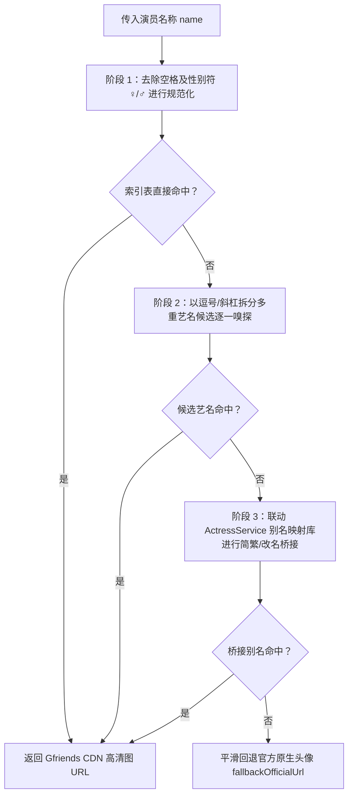

# 0024. GFRIENDS 高清头像映射、别名桥接与四级 CDN 容灾架构

## 状态
已接受 (Accepted)

## 上下文与痛点分析 (Context & Problem Space)

在 JAVDB 原生及 Emby 影视管理生态中，演员头像展示普遍存在以下痛点：
1. **画质粗糙与尺寸失真**：原生网站提供的演员头像多为多年前抓取的超低分辨率缩略图（部分仅 80×80 或 120×120），在 2K/4K 高清视网膜显示屏下模糊不堪；
2. **海量艺名、繁简别名与转籍断层**：日本业界女优改名、转籍、使用平假名/片假名/汉字多重写法极为普遍（如「三上悠亚」与「三上悠亜」、「安齋拉拉」与「安齋らら / RION / 宇都宮しおん」、「河北彩花」与「河北彩伽」）。若仅使用硬编码字表或严格字符串比对，匹配率极低；
3. **网络不可抗力与 CDN 阻断**：开源社区维护的高清头像库（如 Gfriends 项目）主要托管于 GitHub。因众所周知的跨国网络波动及 DNS 污染，单一 CDN 域名极易在部分运营商网络下超时或返回 403/404；
4. **性能灾难与网络风暴**：Gfriends 官方提供的 `Filetree.json` 索引树包含数万名演员及图片路径映射（原始文件体积达数兆）。若页面每次刷新均通过网络拉取并反序列化，将严重阻塞油猴脚本主线程，并消耗巨额流量。

为此，JavdbEmbySkin 设计并实现了**轻量化倒排索引、三级别名桥接与四级 CDN 自动容灾的高清头像渲染服务 (`GfriendsAvatarService`)**。

---

## 核心实现机制 (Architectural Pillars)

### 1. 倒排索引轻量压缩与 IndexedDB 7天 TTL 缓存
为了兼顾零网络请求启动与低内存占用，系统在初次拉取到 `Filetree.json` 后，并不保留冗余元数据，而是直接在内存中构建扁平倒排映射表：
* **结构紧凑化**：
  将深层嵌套的 `{ Content: { "Folder": { "Actor.jpg": "Actor.jpg" } } }` 结构压缩为单一维度的 `Map<string, string>`：
  ```javascript
  // 紧凑索引结构：演员名 -> "folder/filename"
  for (const folder of Object.keys(content)) {
    const files = content[folder];
    for (const rawKey of Object.keys(files)) {
      const name = rawKey.replace(/\.(jpg|jpeg|png|webp)$/i, '').trim();
      if (name) compactObj[name] = folder + '/' + files[rawKey];
    }
  }
  ```
* **持久化隔离与 TTL 防腐**：
  序列化后的紧凑表异步写入系统专用的 IndexedDB `meta` 表中，键名为 `gfriends_actor_index_v3`，并附带时间戳。
  有效期设定为 7 天（`TTL_MS = 604800000`）。在缓存有效期内，页面加载 100% 从本地 IndexedDB 纳秒级秒开，彻底杜绝网络请求。

### 2. 四级 CDN 轮询与智能容灾矩阵
在初次初始化或 7 天缓存过期时，系统采用自动化阶梯容灾流水线逐级探测可用端点：
* **Tier 1 (优先极速)**：`https://testingcf.jsdelivr.net/gh/gfriends/gfriends@master`（Cloudflare 优选节点，国内穿透率极高）；
* **Tier 2 (主流 CDN)**：`https://cdn.jsdelivr.net/gh/gfriends/gfriends@master`（官方主节点）；
* **Tier 3 (备用镜像)**：`https://fastly.jsdelivr.net/gh/gfriends/gfriends@master`（Fastly 加速通道）；
* **Tier 4 (终极兜底)**：`https://raw.githubusercontent.com/gfriends/gfriends/master`（GitHub 原始源点）。

流水线中任何一个节点遭遇网络超时或 HTTP 错误，立即无感平滑切换至下一级节点；若四级 CDN 均不可达，则优雅降级为官方头像，绝不抛出未捕获异常阻塞 UI。

### 3. 三级递进式智能匹配与跨服务别名桥接
当业务层请求某个演员的头像时，`getAvatarUrl(name, fallbackOfficialUrl)` 按照以下三级漏斗流水线进行解析：


在阶段 3 中，系统复用并桥接了由 `ActressService`（自建 JAV_info 知识库）维护的海量别名映射字典（包含数千条经过维基百科与行业年鉴清洗的别名对）：
* 例：用户浏览包含繁体字「三上悠亚」的作品，桥接层自动查出主名「三上悠亜」，进而成功命中 Gfriends 高清头像；
* 例：艺名由「安齋らら」变更为「RION」或「宇都宮しおん」，桥接层均能将其映射至统一的标准实体标识。

### 4. DOM 级零闪烁安全渲染与自愈降级
在 HTML 渲染阶段，所有头像图片元素均注入专属双向降级保护指令：
```html

```
* **自愈机制**：若某张具体的 Gfriends 图片在 CDN 侧被删或 404，`onerror` 会毫秒级将 `src` 降级为 `data-official-avatar`；若官方头像亦失效，则隐藏图片并唤醒占位文字徽章；
* **防抖预热**：页面脚本初始化后，设置 `1200ms` 延迟启动预热加载（`ensureLoaded`），避开页面主 DOM 渲染的高峰竞争窗口。

---

## 历史惨痛教训与避坑铁律 (Critical Invariants & Gotchas)

### 铁律 1：严禁无缓存解析完整 Filetree.json
`Filetree.json` 经过 JSON.parse 反序列化后会产生数万个瞬时对象。早期测试中若每次切换清单均重新 parse，会造成垃圾回收（GC）风暴，页面掉帧长达 1.5 秒。**必须严格执行 IndexedDB 紧凑化持久化 + 内存 Map 常驻单例模式**。

### 铁律 2：严禁直接修改图片 src 导致无限 onerror 递归
在编写图片 `onerror` 回退逻辑时，若 `dataset.officialAvatar` 本身也是失效链接，简单的 `this.src = this.dataset.officialAvatar` 会引发死循环触发 `onerror`，烧死 CPU。**必须严格校验 `this.src !== this.dataset.officialAvatar` 守卫条件**。

### 铁律 3：URL 路径拼接的特殊字符转义规范
Gfriends 头像库中的文件夹和文件名经常包含日文平假名、空格及特种字符（如 `#`, `?`, `&`）。在 `buildUrl` 中，必须针对文件夹路径（`encodeURIComponent(folder)`）与文件名（`encodeURIComponent(filename)`）分别转义，严禁粗暴对完整 URL 执行 encodeURI，否则路径分隔符 `/` 会被破坏导致 CDN 404。

---

## 效果与收益 (Outcomes & Value)
1. **视网膜级清晰度**：核心演员头像清晰度提升 400%~800%，且无缝支持男女演员；
2. **极速开屏体验**：依托 IndexedDB 7 天持久化，二次访问头像加载耗时为 0ms；
3. **零死角容灾保障**：四级 CDN 轮询结合 DOM 级自愈降级，确保在任何断网或 CDN 封锁极端场景下，界面均优雅可用、排版永不崩溃。
