# 0026. 媒体库多维流式筛选器即时草稿状态机与共演交集算子

## 状态
已接受 (Accepted)

## 上下文与多维交互挑战 (Context & Problem Space)

在面对包含数千部作品、上万名演员与错综复杂标签分类的本地影视媒体库时，传统的筛选器往往陷入以下严重的交互与架构缺陷：
1. **状态污染与误操作不可逆（State Pollution & No-Cancel Trap）**：
   许多 Web 筛选组件在用户点击某个标签的瞬间，立即同步修改全局过滤状态并重绘后台列表。当用户在包含数十个维度的弹窗中随意尝试组合、随后改变主意点击「取消」或遮罩层关闭时，底层列表早已被破坏，用户无法恢复到打开弹窗前的浏览状态；
2. **静态全集死角与虚假候选（Dead-End Candidates）**：
   当用户在顶部勾选了「只看有备注」或「看過」时，若下方「演员/系列/片商」候选列表依然机械罗列全量媒体库的所有实体，用户点击某位演员后，经常筛选出 0 部作品（因为该演员的所有作品均未被标记或备注）。这种缺乏上下文感知的静态列表造成极差的交互挫败感；
3. **共演检索的逻辑断层（Co-Acting Logical Gap）**：
   在常规的多选交互中，多选演员通常被解释为**数学并集（OR: $A \cup B$）**。然而在影视库探索中，资深用户经常需要探寻「由演员 A 与演员 B 共同主演的作品」（即**数学交集 AND: $A \cap B$**）。传统系统缺乏共演算子，导致这一高频核心诉求无法被满足；
4. **多域业务状态污染（Cross-Domain Leakage）**：
   系统内同时存在「TOP250 排行榜」、「已收录画廊浏览」与「个人收藏夹」三大独立视图，它们外观高度相似但数据源、存储机制各不相同。若共用同一套筛选状态，将导致各个视图相互污染。

为此，JavdbEmbySkin 设计并实现了**即时草稿快照状态机、子宇宙动态频次收敛与共演交集算子 (`openFilterModal`)**。

---

## 核心实现机制 (Architectural Pillars)

### 1. 即时草稿快照状态机 (Draft Snapshot State Machine)
为了确保用户在弹窗内的任何试探性操作均具备百分之百的安全隔离性，筛选器采用快照暂存模式：

```mermaid
stateDiagram-v2
    [*] --> ActiveState: 页面主列表状态 (state.filters)
    ActiveState --> OpenModal: 用户点击“筛选”按钮
    state OpenModal {
        [*] --> DraftSnapshot: 深拷贝隔离 tmp = JSON.parse(JSON.stringify(cur))
        DraftSnapshot --> Toggling: 用户频繁勾选/取消维度标签、调节评分
        Toggling --> DraftSnapshot: 所有修改仅作用于局部变量 tmp
    }
    OpenModal --> ActiveState: 点击遮罩/取消按钮 -> 直接销毁 DOM，tmp 抛弃，零副作用
    OpenModal --> CommitState: 点击“确定”按钮 (ok)
    CommitState --> ActiveState: state.filters = tmp; 并触发 applyAndRender()
```

* **绝对隔离**：弹窗展开期间，`tmp` 承担全部状态变更，全局视图保持静止；
* **三域解耦**：根据入参 `galleryMode`（`'top250'` / `true` / `false`），快照分别绑定至 `Top250ViewManager`、`galleryFilter` 与 `state.filters`，物理阻断跨模块状态穿透。

### 2. 子宇宙动态频次收敛引擎 (`modalVids` & `refreshModalDims`)
当用户在弹窗顶部切换状态类开关（如「只看有备注」、「只看未补全」、「想看」、「看過」、「只看金标」）时，系统并不等待点击「确定」，而是在弹窗内部**毫秒级重构当前候选子宇宙（Sub-Universe）**：
* **子宇宙派生**：
  `modalVids()` 依据当前草稿中的状态组合，在内存中即时派生出过滤后的作品数组 $V_{\text{sub}}$；
* **全维度动态计数重算 (`refreshModalDims`)**：
  系统遍历演员、金标、类别、系列、片商、导演及年份等全部 7 大维度，重新统计各个实体在 $V_{\text{sub}}$ 中的出现频次与累积浏览量；
* **零死角修剪**：
  在子宇宙中出现频次为 0 的标签被自动剔除，确保弹窗中展示的每一个选项点击后必然命中至少一部作品，彻底消灭「点选后结果为空」的死角。

### 3. 共演筛选交集算子 (`coactMode` & `coactVids`)
当开启「共演筛选（交集）」开关时，演员多选的数学解释由逻辑并集（OR）无缝切换为严格子集交集（AND）：
$$\text{CoactFilter}(V, S) = \left\{ v \in V \;\middle|\; \forall s \in S, \; \exists a \in v.\text{actors} \text{ s.t. } \operatorname{norm}(a.\text{name}) = \operatorname{norm}(s) \right\}$$
* **实时交集收敛反馈 (`onActorToggle`)**：
  当用户选定第一位演员（如「三上悠亜」）后，系统立即将候选源 `dimVidSource` 切换为共演作品集。
  此时，**演员列表中的其它候选人立刻刷新为其共同出演过的演员，且括号内的计数实时变为两者共演的部数**！未与第一位演员共演过的人被瞬间移出列表。用户继续点击第二位演员，候选将进一步收敛。

### 4. 实体级备注与性别双重清洗机制
* **备注实体穿透 (`tallyNotedEntities`)**：
  在「只看有备注」开启时，演员/系列/片商维度的统计范围自动收缩至「被用户直接撰写过批注的实体本身」，避免无辜的共演演员因同部作品带备注而被错误统计；
* **男优动态防御 (`isMaleActor`)**：
  联动 IndexedDB 中的演员性别映射表（`genderMap`）。勾选「隐藏男优」时，算法不仅在候选列表中剔除男优，还会主动检测并修剪 `tmp.actors` 中已被勾选的男优，防止出现「已选但不可见、导致无法取消」的状态死锁。

---

## 历史惨痛教训与避坑铁律 (Critical Invariants & Gotchas)

### 铁律 1：头像查找源必须严守初始化时序
在历史版本中，演员维度渲染头像（`withAvatar`）时直接引用了全局变量 `vids`。由于初始化顺序颠倒，当用户勾选「演员头像」时，`vids` 尚未完成赋值即触发了 `draw`，导致所有演员头像报错并使候选列表整体消失。**必须保证 `vids = modalVids()` 在任何 `computeDimOpts` 与 `draw` 之前严格就绪**。

### 铁律 2：防密码管理器输入框污染注入
弹窗各维度内嵌了过滤搜索框（`dim-search-inp`）。主流密码管理器（如 1Password、Bitwarden、LastPass）常将其误判为表单字段并注入填充浮标，阻挡选项点击。**搜索框必须严格挂载 `data-lpignore="true"`、`data-1p-ignore="true"`、`role="searchbox"` 等全套防护属性，并在挂载后执行 `sanitizeSearchInputs` 净化防御**。

---

## 效果与收益 (Outcomes & Value)
1. **绝对防误触体验**：任意复杂的筛选探索均在沙箱快照中运行，关闭即恢复，安心感倍增；
2. **多演员共演极速挖掘**：共演算子让寻找双人/多人合作作品的操作从过去繁琐的人工对照简化为 2 次轻点；
3. **数据驱动的即时反馈**：动态子宇宙重算让每一个维度的数字真实反映当前约束，探索媒体库如丝般顺滑。
