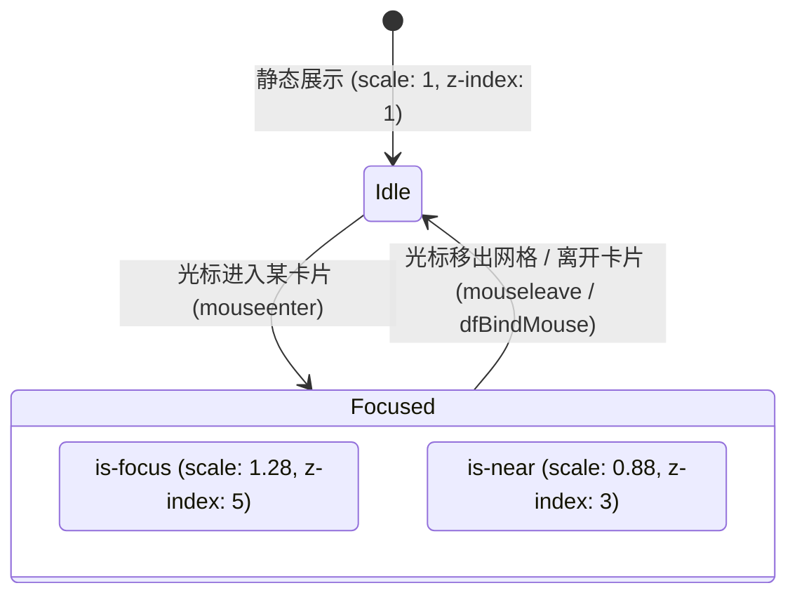

# 0027. DYNAMIC FOCUS 动态聚焦布局、视口防碰撞大图浮层与环境流光跟随架构

## 状态
已接受 (Accepted)

## 上下文与视觉交互革命 (Context & Aesthetic Philosophy)

在传统的流媒体（Netflix、Emby、Plex）及影视检索界面中，海报列表的展现形式数十年来几乎一成不变：
1. **信息噪音过载与视觉切割**：
   传统卡片布局在海报四周堆砌了大量的文字、发布日期、评分星级、标签徽章与磁力状态。这使得原本震撼的电影海报被分割为碎片化的豆腐块，列表充斥着冗余的视觉噪音，用户无法沉浸式领略视觉海报本身的艺术张力；
2. **横版原始封面与竖版展示槽位的天然几何冲突**：
   日本乃至国际影视作品的原始封套发行物均为横版展开图（长宽比通常为 $1.5 \sim 1.6$，如 800×536 或 1000×680）。封套的排版规则具有高度统一的行业特征：**左半部分为作品简介、剧照花絮、条形码及片商 Logo；右半部分则是核心主演演员的高清竖版正脸海报**。
   若直接采用标准 2:3 居中裁切或上下加黑边（Letterbox），要么将女优的面容裁切掉一半，要么画面严重畸变收缩；
3. **传统 Hover 弹窗的穿模与阻断灾难**：
   常规网站的悬停大图预览通常存在严重缺陷：
   * **视口穿模**：大图向上或向右弹出时，直接撞入浏览器顶栏或溢出屏幕边缘，造成半截裁切；
   * **光标遮挡与闪烁循环（Hover Flickering Loop）**：弹出的浮层盖住了鼠标光标，导致底层卡片触发 `mouseleave`，浮层瞬间关闭；浮层关闭后光标重新落在卡片上再次触发 `mouseenter`，形成致命的高频闪烁死循环；
   * **二次网络请求与卡顿**：浮层打开时重新发起高清大图 HTTP 下载，在弱网或并发滚动时引发长达数秒的白屏转圈。

为实现极致的沉浸感与影院级视觉享受，JavdbEmbySkin 首创并深度打磨了**无缝竖版动态聚焦矩阵、右侧黄金人脸裁切、视口防碰撞大图浮层与环境影院光幕跟随系统（Dynamic Focus & Decoupled Popup Engine）**。

---

## 核心实现机制 (Architectural Pillars)

### 1. 零间距流体竖版宫格与右侧黄金焦段算法
动态聚焦模式将整个影片列表转化为一面严丝合缝、无任何缝隙的现代艺术画廊：
* **无间距流体 CSS Grid**：
  ```css
  html.emby-skin.emby-dynamic-focus .movie-list.emby-dynamic-focus {
    display: grid !important;
    grid-template-columns: repeat(auto-fill, minmax(var(--df-col-w, 180px), 1fr)) !important;
    gap: 0 !important;
    padding: 0 !important;
    max-width: 1700px;
    margin: 0 auto !important;
  }
  ```
* **纯视觉降噪（Pure Visual Stripping）**：
  全面剥离卡片内嵌的标题、评分、类别、标签等一切非海报元素，仅保留纯净封面：
  ```css
  .movie-list.emby-dynamic-focus .item .video-title,
  .movie-list.emby-dynamic-focus .item .score,
  .movie-list.emby-dynamic-focus .item .meta,
  .movie-list.emby-dynamic-focus .item .tags { display: none !important; }
  ```
* **右侧人脸黄金锚定定位（$200\%$ 宽右对齐裁切）**：
  卡片容器设定严格的 $2:3$ 黄金竖版比例，内嵌原图宽度设为容器的 $200\%$，并将定位锚点严格锁定于右侧中心（`right center`）：
  ```css
  .movie-list.emby-dynamic-focus .item .box .cover {
    width: 100% !important;
    aspect-ratio: 2 / 3 !important;
    overflow: hidden !important;
  }
  .movie-list.emby-dynamic-focus .item .box .cover img {
    position: absolute !important;
    top: 0 !important; right: 0 !important; left: auto !important; bottom: auto !important;
    width: 200% !important; height: 100% !important;
    object-fit: cover !important;
    object-position: right center !important;
  }
  ```
  **数学与视觉原理**：原始封套长宽比约 $1.5$。当宽度扩展为 $200\%$ 时，展示视窗恰好框取了封套右侧的 $50\%$ 区域（$1.5 \div 2 = 0.75$，即 $3:4 \approx 2:3$）。这一几何映射使得每一张横版封套的右侧女优肖像能够天然、完整、无需任何人工标注地呈现在竖版卡片中。

---

### 2. 呼吸式主客聚焦状态机 (Focus & Near Breathing Matrix)
当光标在网格中移动时，当前悬停单元与周边相邻单元形成极具物理分量感的呼吸起伏联动：

* **空间凸透镜放大**：被聚焦的卡片被赋予 `.is-focus`，瞬间通过硬件变换矩阵放大至 $1.28$ 倍（移动端设为 $1.12$ 倍），`z-index` 提升至 5，层级跳跃打破网格边界；
* **环境谦让避让**：同网格内的其余所有单元同步被赋予 `.is-near`，轻微收缩至 $0.88$ 倍并后撤，形成视觉纵深上的聚焦透视；
* **3D 流光无缝共存**：卡片内部的 `.box` 保持 `border-radius: 0` 与无投影观感，但保留了 STEAM 风格卡牌 3D 物理倾斜与全息高光层（`.emby-card-shine`），在缩放的同时仍能随光标倾斜流转。

---

### 3. 解耦式大图预览气泡与多层防碰撞算法 (`dfPopup`)
动态聚焦虽然实现了艺术画廊般的肖像阵列，但用户仍需查验未经裁切的完整原始封套及作品元数据。系统构建了**与布局彻底解耦、全局单例运行的未裁切大封面浮层系统**。

```
┌────────────────────────────────────────────────────────┐
│ 视口宽度 VW                                             │
│   ┌──────────────────────────────────────────────┐     │
│   │ 顶栏 Header (64px 碰撞安全避让红线)            │     │
│   └──────────────────────────────────────────────┘     │
│                                                        │
│             Top 浮动区 (上方空间充裕时向上展开)           │
│         ┌───────────────────────────────────┐          │
│         │  完整未裁切原图 (Natural Aspect)   │          │
│         ├───────────────────────────────────┤          │
│         │  底部黑底信息镜像条 (+88px Buffer) │          │
│         └───────────────────────────────────┘          │
│                          ▲                             │
│                          │ top = y - 18 - h            │
│                 [光标 (x, y)]                          │
│                          │ top = y + 18                │
│                          ▼                             │
│             Bottom 浮动区 (下方空间充裕时向下展开)        │
└────────────────────────────────────────────────────────┘
```

#### A. 几何尺寸自适应结算 (`dfPopupSize`)
* **零网络开销复用**：直接抓取宿主卡片中已完成加载解码的图片对象 `srcEl.currentSrc || srcEl.src`，耗时 0ms，网络流量 0 字节；
* **原始宽高比继承**：读取已缓存封面的真实物理比例：
  $$\text{Aspect} = \frac{\text{naturalWidth}}{\text{naturalHeight}} \quad (\text{降级默认 } 1.5)$$
* **自适应宽度与信息条高度冗余缓冲**：
  $$W = \operatorname{clamp}\left(320\text{px}, \; \operatorname{round}(VW \times \text{dfPreviewSizeVw}()), \; \operatorname{round}(0.85 \times VW)\right)$$
  $$H = \operatorname{round}\left(\frac{W}{\text{Aspect}}\right) + 88\text{px}$$
  $88\text{px}$ 的底部垂直缓冲区为番号、标题、评分星级、金标徽章、演员及自定义批注提供了充裕的折行空间，彻底杜绝文字溢出裁切。

#### B. 双向上下视口动态避让算法
计算光标距离视口顶部与底部的物理剩余空间，动态决定弹出朝向：
```javascript
const below = (vh - dfPopup.y) >= dfPopup.y;
let top = below ? dfPopup.y + 18 : dfPopup.y - 18 - h;
top = Math.max(64, Math.min(top, vh - h - 12)); // 64px 强制避开系统顶栏，12px 屏幕底边安全边距
p.style.transformOrigin = below ? 'top center' : 'bottom center';
```
* 当下方空间更大时，大图于光标下方 $+18\text{px}$ 处展开，动画原点锚定在 `top center`；
* 当下方空间不足时，大图自光标上方 $-18\text{px} - H$ 处展开，动画原点锚定在 `bottom center`；
* 永远预留 18px 物理空隙，**浮层绝对不会遮挡住鼠标光标**，从数学原理上消灭了光标碰撞闪烁。

#### C. 水平防溢出钳位 (Horizontal Clamping)
```javascript
let x = dfPopup.x - Math.round(w / 2) + 24; // 向右偏置 24px，避开当前卡片光标垂直列
x = Math.max(12, Math.min(x, vw - w - 12));  // 左右两侧严格锁定 12px 视口缓冲区
```

---

### 4. 影院级环境光幕 (`#emby-df-scrim`) 与滞后阻尼 (`dfHoverStart`)
* **全屏暗色环境遮罩**：
  浮层激活时，同步唤醒全局 `#emby-df-scrim`（`rgba(0,0,0, .55)`，`z-index: 2147482998`）。背景网页被柔和压暗，将用户的注意力全部聚焦于居中大图与信息条；
* **物理事件穿透保证**：
  遮罩层与气泡容器均声明 `pointer-events: none !important;`。用户在浮层展开时依然可以正常点击卡片、滚动滑轮或点击任何页面交互元素，绝无任何点击拦截；
* **感知滞后防眩晕阻尼 (Hysteresis Delay)**：
  光标划入卡片后启动倒计时定时器（默认 $800\text{ms}$，可在设置滑块中调控为 $0.1\text{s} \sim 3\text{s}$）。快速掠过海量网格时不会触发浮层，唯有用户驻留光标凝视时才优雅绽放，有效防止视觉疲劳。

---

## 历史惨痛教训与五大避坑铁律 (Critical Invariants & Gotchas)

### 铁律 1：严禁未传事件对象的直接属性访问 (v7.107 致命 BUG 复盘)
在 v7.107 之前的实现中，`attachDynamicFocus` 内的监听函数写为：
```javascript
box.addEventListener('mouseenter', function () {
  // 致命错误：外部函数未声明参数 ev，内部却直接访问了 e.clientX
  dfHoverStart(cell, e.clientX, e.clientY); 
});
```
在严格模式或不同浏览器环境下，未声明的 `e` 直接抛出 `ReferenceError: e is not defined`。更致命的是，该异常在 `ensureDynamicFocusGrid` 之前抛出，导致网格委托彻底瘫痪，卡片在触发 `scale(1.28)` 后永久冻结放大、无法复原，且大图浮层永远消失。
**防御规范：事件处理函数必须显式声明 `(ev)` 参数，并对 `ensureDynamicFocusGrid`、`updateDynamicFocusGrid` 与 `dfHoverStart` 逐一包裹 `try/catch` 隔离保护**。

### 铁律 2：DOM 树脱水期未连接节点的惰性委托
在收藏夹与搜索视图中，卡片是通过 `buildCard` 动态生成的。在调用 `attachDynamicFocus(box)` 时，`box` 尚未挂载到真实 DOM 树中（`box.isConnected === false`）。
若在绑定时直接执行 `const grid = box.closest('.movie-list')`，返回值必然为 `null`！
**防御规范：严禁在初始化时静态捕获父级网格，必须推迟至 `mouseenter` 事件触发时动态执行 `box.closest(...)` 惰性嗅探，并在卡片初次悬停时即时挂载网格级委托 `ensureDynamicFocusGrid(grid)`**。

### 铁律 3：全局光标几何包围盒兜底守护 (`dfBindMouse`)
在收藏夹排序、异步分页增量渲染或用户剧烈甩动鼠标时，浏览器的原生 `mouseleave` 事件可能因 DOM 节点重排而被偶发丢失。
为此，系统在 `document` 上挂载了常驻的 `mousemove` 物理位置检测：
```javascript
document.addEventListener('mousemove', function (e) {
  if (!dfPopup.item) return;
  const r = dfPopup.item.getBoundingClientRect();
  const out = e.clientX < r.left || e.clientX > r.right || e.clientY < r.top || e.clientY > r.bottom;
  if (out) {
    dfPopupHide();
    if (g) updateDynamicFocusGrid(g, null); // 强制重置网格所有缩放
  }
});
```
只要光标的物理坐标脱离了卡片的矩形包围盒，无论原生事件是否丢失，均会在下一帧强制抹除 `.is-focus` 并撤回浮层。

### 铁律 4：滚动即收机制 (Scroll Invalidation)
气泡与遮罩均采用 `position: fixed` 定位。若用户在浮层展开状态下滚动鼠标滚轮，卡片物理位置会发生位移而气泡悬空错位。
**防御规范：全局监听 `window.addEventListener('scroll', dfPopupHide, true)`，页面产生任何滚动瞬间关闭气泡，待悬停稳定后重新定向**。

### 铁律 5：标题与元数据克隆脱敏去重
在生成大图下方的信息条时，直接读取 `.video-title` 或 `.meta` 的 `textContent` 会导致内部嵌套的徽章文字（如「金标」、「想看」圆点）与无演员作品的行内备注（`.efav-card-note`）被机械拼接，造成信息重复显示。
**防御规范：读取文字前必须通过 `cloneNode(true)` 生成深拷贝节点，显式删除 `strong, .efav-award-badge, .efav-dot, .efav-card-note` 后再提取纯净文本**。

---

## 效果与收益 (Outcomes & Value)
1. **画廊级艺术震撼**：以 $200\%$ 宽右对齐裁切彻底化解了横版封套在竖版网格中的排版死局，每一张封面都成为极具冲击力的人像海报；
2. **零延迟即时交互**：全盘复用内存已有图片纹理，大图预览秒开零网络请求；
3. **影院级全景沉浸**：视口双向避让结合环境暗色遮罩，在方寸之间营造出置身私人家用影院般的探索质感。
