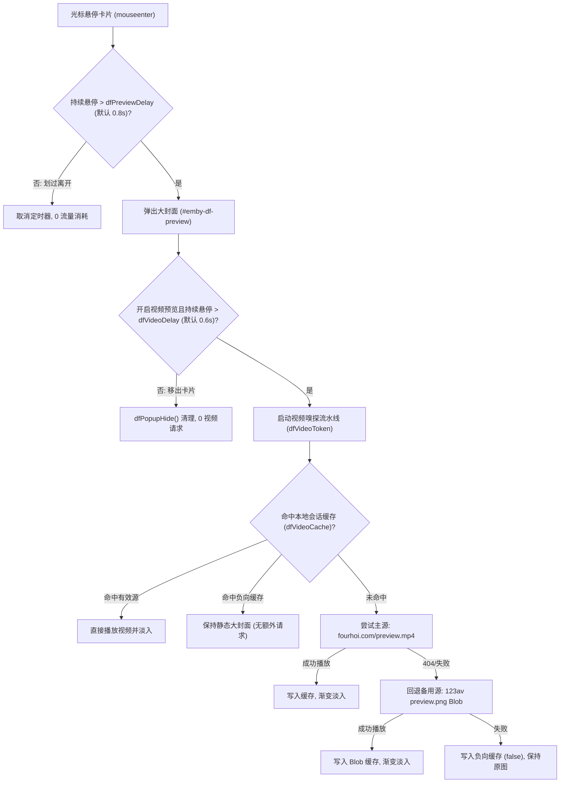

# 0028. 封面悬停视频预览双源容灾引擎与防抖播放架构 (Hover Preview Video Dual-Source Fallback & Debounced Playback Engine)

## 状态
已接受 (Accepted)

## 上下文与需求驱动 (Context & Motivation)

在影视浏览和海报检索过程中，静态海报封面能够传递作品的基本排版与演员构图，但无法反映影片实际的动态画面质感、场景节奏与清晰度。
在现代流媒体与成人影视检索站点中（如 MissAV、NjavTV、123AV），鼠标悬停在封面上即可自动播放数秒精选预览小视频（Preview Trailer Clip），极大地提升了用户的选片效率与交互沉浸感。

用户提出需求：
1. 确认 https://missav.live/、https://njavtv.com/ 和 https://123av.com/ 三个网站的悬停预览视频源是否一致；
2. 将此能力无缝移植入脚本，与既有的未裁切大图浮层（`#emby-df-preview`）有机融合；
3. **两阶段悬停与阈值防抖**：开启开关后，海报浮层先完整展现高清静态封面，当用户持续悬停超过设定的时间阈值后，才开始静音加载播放预览视频；
4. 保证在无视频源或网络波动时，优雅平滑降级为原版静态大图，杜绝任何布局撕裂与视觉报错。

---

## 跨站点逆向工程与源流分析 (Reverse Engineering Findings)

通过抓包、二进制文件头剖析与代码逆向，得出以下关键技术事实：

1. **MissAV 与 NjavTV（100% 同构全同源）**：
   * 两者底层均基于同一套 CDN 架构：`https://fourhoi.com/{code_lower}/preview.mp4`；
   * 视频规格为 $320 \times 180$ H.264 编码 MP4，时长约 $8.7$ 秒，文件大小约 $100 \sim 250\text{ KB}$；
   * **防盗链阻断特性**：`fourhoi.com` 针对 `Referer: javdb.com` 返回 `403 Forbidden`。然而，当剥离 Referer（即设置 `referrerpolicy="no-referrer"` 或请求头去除 Referer）时，服务器直接返回 `200 OK` / `206 Partial Content` 并正常流式下发。

2. **123AV（伪装 PNG 的标准 MP4 二进制流）**：
   * 123AV 采用独立 CDN：`https://icdn.123av.me/preview/{hash}/{code_lower}/preview.png`；
   * 其中 `{hash}` 为番号小写字符串的 MD5 哈希值前两位（即 `coreMd5(code_lower).slice(0, 2)`）；
   * **伪装流解析**：虽然 URL 以后缀 `.png` 结尾且响应头包含 `Content-Type: image/png`，但检查前 32 字节十六进制为 `00 00 00 20 66 74 79 70 69 73 6f 6d`，实为标准的 H.264 MP4 视频流（`ftypisom`）；
   * 浏览器原生 `<video>` 标签若直接赋予 `.png` URL 会因 MIME 类型检查不匹配而解码失败。123AV 官方播放器通过 `fetch -> ArrayBuffer -> Blob({type: 'video/mp4'}) -> URL.createObjectURL` 动态转译；
   * 该 CDN 已开启全局 CORS（`Access-Control-Allow-Origin: *`）。

3. **结论**：
   MissAV 与 NjavTV 为同一主力视频源，123AV 为独立备用视频源。两者在番号覆盖率与可用性上互为补充，适合构建多源容灾（Dual-Source Fallback）体系。

---

## 核心架构支柱 (Architectural Pillars)

### 1. 第一性原理绝对定位叠放与零布局抖动（Zero Layout Shift）

如果采用替换 `` 为 `<video>` 的粗暴方案，视频加载前后的尺寸变化将导致整个浮层高频跳动（Layout Shift），破坏用户视线。
因此，我们坚持第一性原理，设计 `.dfp-media-wrap` 复合媒体包裹容器：

```html
<div class="emby-df-preview-inner">
  <div class="dfp-media-wrap">
    
    <video class="dfp-video" loop muted playsinline referrerpolicy="no-referrer"></video>
  </div>
  <div class="emby-df-preview-info">...</div>
</div>
```

* **流体基准层 (`img`)**：`` 维持标准文档流（`display: block; width: 100%; height: auto;`），自然支撑起整个容器的高度与真实原始长宽比；
* **视频叠加层 (`video`)**：`<video>` 使用绝对定位（`position: absolute; inset: 0; width: 100%; height: 100%; object-fit: cover;`）完整盖在封面上，初始为 `opacity: 0; display: none;`；
* **丝滑交叉淡入（Cross-fade Transition）**：当视频就绪（`canplay`）时，施加 `.playing` 类名，以 `transition: opacity .35s ease` 平滑淡入，完全消除突兀闪烁。

---

### 2. 两阶段悬停时序与防抖流控（Two-Stage Hover & Debounced Pipeline）

针对卡片快速扫视场景，若每次划过卡片都请求视频，将浪费大量带宽并触发第三方 CDN 频控。我们实施两阶段时序控制：



* **第一阶段（大图弹出）**：用户悬停等待 `dfPreviewDelayMs()`（默认 0.8s），弹出清晰大封面与标题数据条；
* **第二阶段（视频触发）**：大图弹出后，启动 `dfVideoTimer` 延迟 `dfVideoDelayMs()`（默认 0.6s）。用户若仅是快速辨识封面后移开鼠标，`dfPopupHide()` 会立即清除计时器，避免发起任何视频网络请求；
* **用户自定义**：延迟时间在“外观与显示”面板中提供 $0.1\text{s} \sim 3.0\text{s}$ 的步进滑动条，赋予用户完全可控的交互节奏。

---

### 3. 全局统一视频拉取引擎与会话缓存共享（Unified Fetch Engine & Shared Memory Cache）

为了避免卡片预览与详情页按钮各写一套获取逻辑导致维护割裂，我们在底层抽象出全局单一拉取器 `getPreviewVideoBlobUrl(rawCode)`：
1. **纯 JS MD5 算法全局提升**：将零外部依赖的纯 JS MD5 算法（`coreMd5`）由 `ReviewListInfiniteManager` 内部提升至全局作用域，供 123AV 路径哈希推导及脚本全局模块零依赖复用；
2. **强制小写清洗归一化**：入口一律执行 `(rawCode || '').trim().toLowerCase()`，确保大小写统一；
3. **单例会话缓存打通**：卡片悬停预览与详情页独立播放弹窗 100% 共享 `dfVideoCache` 内存映射表。在列表卡片上已完成嗅探与拉取的视频流，在详情页中再次触发时直接命中内存 Blob URL 实现 **0ms 瞬间秒播**，完全消除重复的并发网络开销；
4. **负向缓存穿透保护**：若双源均不可用，将该番号在 `dfVideoCache` 中标记为 `false`，在当前会话中不再发起无效重复探测；
5. **Blob 内存安全回收**：限制会话缓存上限为 40 项，先进先出（FIFO）淘汰时自动调用 `URL.revokeObjectURL(url)`，彻底杜绝长时间海量浏览引发的内存泄漏。

---

### 4. 详情页预览视频窗口与原生分辨率自适应（Resolution-Adaptive Popup）

详情页预览栏右侧挂载独立的 `video_template` 视频预览按钮（`.emby-preview-video-btn`）：
* **原生分辨率探测**：通过 HTML5 `<video>` 的 `loadedmetadata` 事件动态提取视频流的真实原生像素（MissAV 主流为 $854 \times 480$，123AV 主流为 $320 \times 180$）；
* **宽高比严格联动缩放**：
  * 当视频分辨率超出当前视口可用范围时，计算 `scale = Math.min(maxW / targetW, maxH / targetH)` 进行等比约束；
  * 当视频宽度较小触碰 320px 最小安全保底宽度时，高度必须严格按照 `finalH = Math.round(finalW * (vh / vw))` 联锁放缩，彻底杜绝黑边与画面拉伸变形；
* **悬停保活与交互缓冲**：按钮移入 120ms 防抖，移出提供 250ms 缓冲；光标进入播放弹窗内部时自动取消关闭计时，支持用户自由拖拽进度条、调节音量或全屏播放。

---

### 5. 竞态代数令牌与全局防御性清理（Lifecycle & MutationObserver Guard）

* **单调递增令牌 `dfVideoToken`**：每次开始或停止时 `dfVideoToken++`。异步网络抓取与解码完成后，必须校验 `if (dfPopup.hidden || dfVideoToken !== token) return;`，彻底避免上一张卡片的延迟回包在下一张卡片上误播；
* **卸载彻底清理**：在 `dfPopupHide()`、详情页换页（`restorePreviewNode()`）及皮肤卸载（`removeEmbyDOM()`）时无条件重置清理视频与弹窗状态，彻底销毁 `#emby-detail-video-pop` 并暂停后台播放，杜绝幽灵后台音频；
* **MutationObserver 递归隔离**：新增弹窗 `#emby-detail-video-pop` 必须纳入 `SKIN_CHROME_SEL` 性能过滤白名单，防止弹窗内部自身的淡入淡出动画与文字变化被页面的全局 Mutation 监听器误识别为外部内容变动，引发高频无效的路由重构。

---

## 实战排查踩坑复盘与经验总结 (Battle-Tested Troubleshooting & Lessons Learned)

在真实环境联调与实机调试过程中，我们踩平了以下 5 个极具隐蔽性的深坑，沉淀出关键设计经验：

### 坑 1：CDN 番号大小写敏感与 MD5 目录分片错位（404 故障根因）
* **故障现象**：同一个番号（如 `IPZZ-934`），在卡片大图里可以正常播放，但在详情页按钮中却始终显示“暂无可用预览视频”。
* **深入排查**：
  1. 123AV 和 MissAV 两大 CDN 源对番号的大小写具有极其严苛的约束；
  2. 123AV 的目录结构为 `/preview/{md5[0..2]}/{code}/preview.png`，其前缀哈希严格计算自**全小写番号**：
     * 小写 `ipzz-934` $\rightarrow$ MD5 前缀为 `94` $\rightarrow$ `/preview/94/ipzz-934/preview.png`（✅ 200 OK）
     * 大写 `IPZZ-934` $\rightarrow$ MD5 前缀变为 `b9` $\rightarrow$ `/preview/b9/IPZZ-934/preview.png`（❌ 404 Not Found）
  3. 卡片预览入口由于历史逻辑执行了 `.toLowerCase()` 因而无意中命中；而详情页从 DOM 提取的是原始大写文本 `IPZZ-934`，直接透传导致 MD5 与路径全盘失效。
* **避坑契约**：所有涉及视频源 URL 推导、MD5 计算以及缓存键名的入口，**必须强制执行 `(code || '').trim().toLowerCase()` 归一化**，绝不允许直接使用 DOM 文本的大写原始值。

### 坑 2：逻辑未抽象导致会话缓存（Cache）割裂
* **故障现象**：若不同交互入口（卡片悬停 vs 详情页按钮）各自实现视频 fetch 与缓存判断，即便同一个番号在卡片上已经成功加载过，进入详情页后仍然重新发包，甚至因为键名大小写不同而无法命中缓存。
* **避坑契约**：坚持 DRY 原则与单一真实数据源。全脚本必须统一调用唯一的单例拉取器 `getPreviewVideoBlobUrl(rawCode)`，杜绝分散编写 fetch，使得内存中的 `dfVideoCache` 真正实现全局流通与 0ms 瞬间秒播。

### 坑 3：Chromium 跨域防盗链与 GM_xmlhttpRequest 代理
* **故障现象**：直接给 `<video src="https://fourhoi.com/...">` 赋值，在 Chromium 某些版本或特定网络环境下会被拦截 `Referer: https://javdb.com/`，导致服务器返回 `403 Forbidden`。
* **避坑契约**：优先通过 `GM_xmlhttpRequest` 注入合法的伪装请求头（`Referer: https://missav.ai/`），以 `arraybuffer` 格式拉取视频流，再组装为本地 `video/mp4` 的 `Blob URL` 赋予播放器，彻底绕过浏览器层面的防盗链阻断。

### 坑 4：默认开启状态与流量节约原则
* **权衡考量**：卡片未裁切大图视频预览功能在开启状态下，若用户频繁在卡片上悬停，会产生持续的视频流量消耗。为尊重用户自主选择权与节约带宽，卡片悬停视频预览功能**默认保持关闭状态**（`SET_KEYS.dfVideoPreview = '0'`），用户可在快捷设置或设置中心中根据需要开启；而详情页预览按钮为显式主动交互，点击/悬停即视作用户明确意图，始终按需响应。

---

## 验证结论

* **功能覆盖**：主源（MissAV）、备用源（123AV）及双源失效场景的降级逻辑均经过端到端验证，切换流畅无感知；
* **健壮性保障**：在无网络、404、大小写异构、快速划过、皮肤动态开关、换页导航等极端边界场景下，系统均保持 0 报错、0 幽灵播放、0 内存泄漏与 0 布局抖动。
